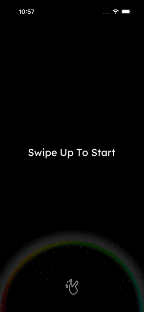
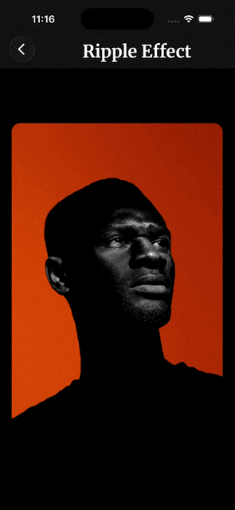

# quattro4maggi

A collection of **production-quality** React Native animation experiments built with Skia and Reanimated.

Clone them. Learn from them. Ship them.

**[Join early access (free during beta)](https://quattro4maggi.com)**

[quattro4maggi.com](https://quattro4maggi.com) · [@m090009](https://x.com/m090009)

---

## Demos

| Demo                                                           | Preview                                                                                                                                | Description                                                                                          |
| -------------------------------------------------------------- | -------------------------------------------------------------------------------------------------------------------------------------- | ---------------------------------------------------------------------------------------------------- |
| [Wabi & More](/src/components/wabi-and-more/README.md)         |                                                                                          | Interactive prism bubble with gesture-driven reveals, split-flap text, and particle effects          |
| [Ripple Effect](./src/components/ripple-effect/)               |                                                                                  | Touch-reactive ripple shader with customizable colors                                                |
| [Scale Flip Card](/src/components/scale-flip-card/README.md)   |                                                                                  | Card component that expands into a fullscreen portal with 3D flip animation                          |
| [Text Flyin](/src/components/text-flyin/README.md)             |                                                                                            | Kinetic text animation with staggered character fly-in effect                                        |
| [Liquid Metal](/src/components/liquid-metal/README.md)         | <br><video src="./assets/videos/liquid_metal_button.mp4" width="220" controls></video> | Skia shader component with animated liquid metal effects and customizable colors                     |
| [Live Border Card](/src/components/live-border-card/README.md) |                                                                                | Animated glowing borders with rotating color gradients and customizable glow effects                 |
| [Pull To Refresh](/src/components/pull-to-refresh/README.md)   | _no capture yet_                                                                                                                       | Gesture-driven pull-to-refresh with a three-stage animation, switchable iOS/Android layout models, and a sticky Threads-style glyph header driven by the same lifecycle |

---

## Quick Start

```bash
git clone https://github.com/m090009/quattro4maggi.git
cd quattro4maggi
bun install
bun run start
```

---

## Tech Stack

- [Expo](https://expo.dev) + [Expo Router](https://expo.github.io/router)
- [React Native Skia](https://shopify.github.io/react-native-skia/)
- [Reanimated 4](https://docs.swmansion.com/react-native-reanimated/)

---

## Structure

```
src/
├── app/                    # Expo Router routes
│   ├── index.tsx           # Home gallery
│   └── [demo-name]/        # Individual demo routes
├── components/             # Demo-specific components
│   └── [demo-name]/
├── hooks/
└── lib/
    ├── animations/         # Animation constants
    └── shaders/            # Skia shader definitions
```

---

## Want to Actually Master This?

Most React Native animations look good in isolation but fall apart in real apps.

In the membership, I break these down step-by-step:

- How the animation actually works
- How to make it production-ready
- How to reuse the patterns in your own apps

\+ 4 new deep dives every month

The code here is free.  
But understanding how to adapt it to your app is where most people get stuck.

### [Join Early Access (free during beta) at quattro4maggi.com](https://quattro4maggi.com)


> Full **Wabi Timer replica** (gestures + interactions + bubble particles) is available exclusively for early access members at [quattro4maggi.com](https://quattro4maggi.com) — free during beta.

---

## License

MIT — use freely in your projects. A star or mention is appreciated!
