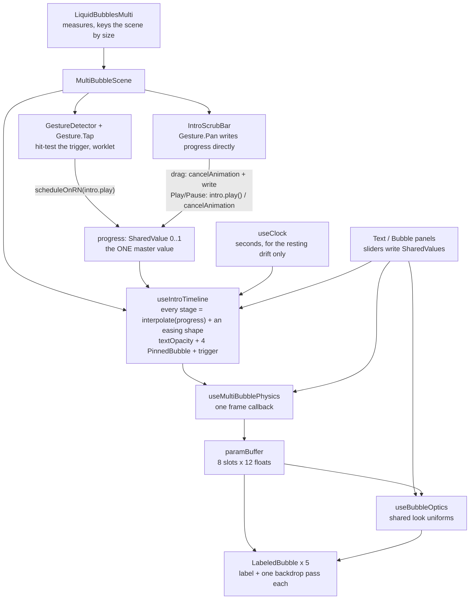
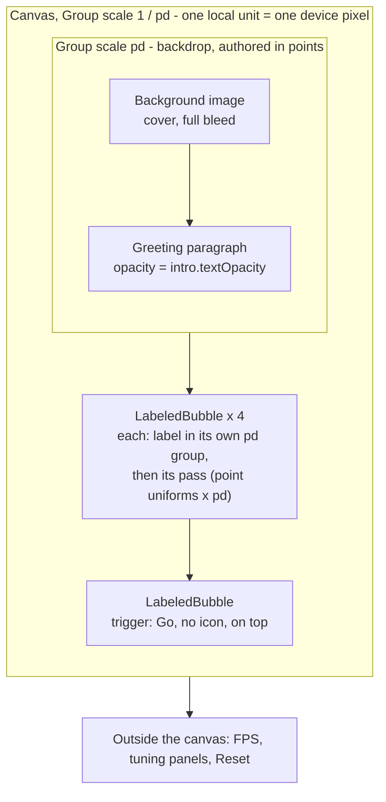

# Liquid Bubbles Multi

A small "Explore thoughts" trigger bubble sits under the greeting. Tap it and
the greeting collapses into four labelled glass bubbles, heading toward one
shader pass for all of them.

- Plan and cost comparison: [`../liquid-bubble-live/multi_bubble.md`](../liquid-bubble-live/multi_bubble.md)
- The intro's timeline, curves and timing constants: [`animation_timeline.md`](animation_timeline.md)

Separate from `liquid-bubble-live/`: it imports only that folder's pure
modules (`bubbleModes.ts`, `hooks/bubbleModeMath.ts`) and never touches the
single bubble's state.

## Files

- `LiquidBubblesMulti.tsx`: screen — greeting, the bubbles, panels, FPS
- `LabeledBubble.tsx`: one bubble as one component — its label, then its glass pass
- `BaselineBubble.tsx`: one of today's single-bubble passes for one buffer slot (phase 2 baseline)
- `BubbleLabel.tsx`: one intro bubble's text + icon, riding along inside it
- `bubbleIcon.ts`: the `BubbleIcon` spec (path, box, size, colour, gap, stroke) + defaults
- `IconPaths.ts`: the glyphs themselves, and `INTRO_ICONS` — one per intro label
- `TextTuningPanel.tsx`: live controls for the greeting and the bubbles' position
- `IntroScrubBar.tsx`: drags the intro's `progress` value by hand, to choreograph it
- `multiBubbleConfig.ts`: count, buffer size, spawn stagger, inflate spring, intro timeline
- `hooks/multiBubbleMath.ts`: one bubble's float life cycle as a pure step (+ test)
- `hooks/useMultiBubblePhysics.ts`: float + shape for every bubble in one frame callback
- `hooks/useIntroTimeline.ts`: rest state ↔ intro, as one scrubbable `progress` value — the trigger bubble, and the swell/collapse → four-bubbles run it kicks off
- `animation_timeline.md`: the intro's stages, curves, constants and the reasoning — the reference for changing how it feels

Tests: `bun test src/components/liquid-bubbles-multi`

## Structure

What drives what. Everything below `MultiBubbleScene` runs on the UI thread;
the sliders write SharedValues, so dragging one never re-renders React.



And what the canvas draws. Arrows are draw order, which is also refraction
order: the glass only bends what was drawn before it. The backdrop sits
INSIDE the `pd` group (authored in points); the passes sit outside it but
still inside `1 / pd`, which is what puts their filter in device pixels.



## Design notes

### LiquidBubblesMulti.tsx

```
 onLayout → size → scene (keyed by size: the physics captures the walls)
 fontMgr ready → intro.reset() arms the rest state (progress → 0, no autoplay)
 tap the trigger bubble → GestureDetector worklet → scheduleOnRN(intro.play)
 drag IntroScrubBar     → cancelAnimation(progress) → writes progress directly
 draw     background image → greeting paragraph (× intro.textOpacity)
                → floaters
                → the four intro bubbles, each label-then-glass
                → the trigger bubble, label-then-glass
```

- **Reuses the single bubble's look read-only:** `shaders.ts`,
  `useBubbleOptics`, `BubbleTuningPanel`, `useClock`, `liveConfig.ts`,
  `backgroundShaders.ts` (currently unused: the backdrop is plain white).
  They hold no shared state, so the two demos can't interfere.
- **Greeting:** a centered Skia `Paragraph` — "Good Morning" / the name on
  two lines — in PT Serif. It is **two styled runs**, not one: the builder's
  style stack takes a `pushStyle` / `addText` / `pop` triple per run, so the
  name gets its own colour (and could take its own family or size). Line
  metrics still report the name as line 2, so anything measured off it — the
  trigger's position, the squiggle — follows for free. It is drawn BEFORE the
  bubble, so the glass refracts it.
- **The squiggle** under the name is no longer drawn, but everything behind it
  is still wired: the `SQWIGGLE` path, `squiggleTransform` / `squiggleStroke`,
  and the Text panel's thickness and gap sliders. Re-add a `Group` with those
  inside the greeting to bring it back.
- **No autoplay.** Once `fontMgr` resolves, the screen calls
  `intro.reset()` — the same call the Reset button makes — which brings
  `progress` back to 0: full-size (fully opaque) greeting, the four bubbles
  gone, the trigger bubble inflated in under the paragraph.
- **The trigger bubble** is a fifth pinned slot
  (`FLOATER_COUNT + INTRO_COUNT`), centred under the greeting paragraph's
  bottom edge (`TRIGGER_GAP` below it). The paragraph's half-height is scaled
  by the Text panel's Size slider before the gap is added, since the bubble is
  drawn outside the text group and doesn't inherit that scale. It
  doesn't float or drift — a still bubble until it's tapped. The `Canvas` is
  wrapped in a `GestureDetector` with `Gesture.Tap()`; its `onEnd` worklet
  hit-tests the tap against the trigger's live `x` / `y` / `r` (`r × 1.25`
  slop) and, if it hits and the trigger is still inflated,
  `scheduleOnRN`s `intro.play()`. Outside the bubble, or after it has
  emptied, the tap does nothing.
- **Intro bubbles:** slots `FLOATER_COUNT …  + INTRO_COUNT − 1`, all pinned
  (no buoyancy float) and driven by `useIntroTimeline`. Drawn after the
  trigger's label but before the trigger's own pass, so they sit under it.
  Each one's label is drawn just before it, so the glass refracts its own
  text.
- **Reset** (top right, was "Replay") calls `intro.reset()`, running
  `progress` back to 0 — which, because every value in `useIntroTimeline` is
  a pure function of `progress`, reproduces the rest state (four bubbles
  gone, greeting back, trigger reinflated) without any extra reset logic.
- **`IntroScrubBar`** (`SHOW_SCRUB_BAR`, bottom of the screen): drags
  `intro.progress` directly to choreograph the intro by hand, plus a
  Play/Pause pair. See [`animation_timeline.md`](animation_timeline.md) and
  the component's own header. Off it for an FPS run.
- **`CRISP_BUBBLES` / the DPR sandwich:** Skia can't apply the canvas matrix
  to a `RuntimeShader` image filter, so it factors the scale out and
  snapshots the backdrop at **1 texel per local unit** — at logical size
  that is 1 texel per point, upscaled `pd`× on screen, which is why text
  seen through the glass looked pixelated. So the whole canvas sits in a
  `1 / pd` group (`DPR_DOWN`): the bubbles' local unit is now a device
  pixel. The backdrop content sits in a matching `pd` group (`DPR_UP`) and
  is still authored in points; the bubbles sit outside it and get
  `pixelDensity={PD}`, which scales their point uniforms and clip.
  It costs ~`pd²` texels per pass — flip `CRISP_BUBBLES` to compare FPS.
- **Floaters are off** (`SHOW_FLOATERS = false`) while the text is being
  designed; set it true for the phase 2 stress baseline.
- **Panels** (one at a time, top right): **Text** (size, vertical, squiggle
  thickness/gap, bubble X/Y) and **Bubble** (`BubbleTuningPanel`: size,
  wobble, inertia, strength + all the optics). Every slider writes a
  SharedValue — dragging never re-renders React; Size scales the text group
  instead of rebuilding the paragraph.
- **Cosine film only**, no soap-film pass. The only gesture is the trigger
  tap; the floaters still have none.

### LabeledBubble.tsx

One bubble as one component: its `BubbleLabel` (icon + text), then its
`BaselineBubble` pass. Everything a bubble needs is a prop — the `IntroBubble`,
the buffer slot, the laid-out paragraph, and its **icon path**.

- **The order inside is the point.** Label before pass, so the glass refracts
  its own contents. A caller can't split the pair or get the order wrong.
- **It carries its own half of the DPR sandwich.** The screen's outer group is
  `1 / pd`; this component puts the LABEL back in points with its own `pd`
  group, and leaves the PASS outside it so the filter still runs in device
  pixels. That's why it can sit directly under `DPR_DOWN` with no `DPR_UP`
  wrapper around it.
- **Icons are per bubble.** `icon?: BubbleIcon` → `IconPaths.ts`. The four
  intro bubbles take `INTRO_ICONS[i]`; the trigger passes `showIcon={false}`,
  since "Go" is the whole label.
- **Rendered off the SLOTS, not off `labels`:** the glass has to be on screen
  from the first frame, while the paragraphs are still null until `fontMgr`
  resolves. A null paragraph just skips the label.
- Interleaving label/pass per bubble instead of "all labels, then all passes"
  reads identically — the bubbles don't overlap — at the cost of one extra
  `Group` per bubble and no `saveLayer`.

### bubbleIcon.ts / IconPaths.ts

`bubbleIcon.ts` is the SPEC: `{ path, box, size?, color?, gap?, strokeWidth? }`
plus the defaults. `IconPaths.ts` is the glyph library.

- **`box` is per icon**, and it matters: the X mark is authored in a 24
  viewBox, the three hand-drawn ones in a 100 box. `BubbleLabel` scales
  whatever it's handed by `size / box`, so the two mix freely.
- **`strokeWidth` for open paths.** The book glyph is mostly open line
  segments (spine, text rules); filled, they vanish and the covers blob. It
  declares a stroke width in its OWN authoring units — the group is already
  scaled to `size`.
- **`BUBBLE_CONTENT_PAD` is the bubble-to-content padding knob.**
  `BubbleLabel` centres the whole block — icon, gap, text — on the bubble's
  centre and then nudges it down by this. Centring the block is the part that
  matters: the paragraph alone used to be centred with the icon hanging off
  its top, so the content reached `h/2 + gap + iconSize` upward but only
  `h/2` down — the icon crowded the rim while the bottom of the bubble sat
  empty. Raise the constant for more headroom over the icon, at the cost of
  the slack underneath.
- **Size relative to R is the other half of the padding**, via
  `INTRO_LABEL_SIZE` and `BUBBLE_ICON_SIZE` (the label is scaled by
  `r / rest` at draw time). Note `INTRO_LABEL_WIDTH_MUL` only bounds where a
  line BREAKS — a single word wider than it ("Portuguese") overflows rather
  than wrapping, so narrowing it past that word's width buys no side padding.

### BaselineBubble.tsx

The phase 2 stress baseline: today's `BackdropFilter` + `liveBubbleEffect`,
once per slot, so 5 bubbles cost ~15 pass breaks.

- `iParams` = this slot's 12 floats (a 12-float slice per frame).
- **Clip** is a circle bound, `R·(1 + |a2| + |a3| + |a4|)`, grown by the same
  refract / lens / dispersion / halo padding as the single bubble. A waiting
  slot (R = 0) gets an empty clip.
- **`pixelDensity`** multiplies everything it hands the shader in points —
  `iParams` cx / cy / R, `iRefract`, `iOptics.y` (rim width) — and the clip.
  Nothing else: the remaining levers are fractions of R, so they follow. The
  rim AA (`smoothstep(±0.75, d)`) is now ±0.75 device px rather than points,
  which is a sharper edge, not a broken one.

### hooks/useIntroTimeline.ts

The rest state ↔ intro run, as one scrubbable `progress` value. **The stage
breakdown, the curves, the timing constants and the reasoning behind them all
live in [`animation_timeline.md`](animation_timeline.md)** — read that to
change how the intro looks or feels. What matters here is only its shape as a
hook:

- **One `progress: SharedValue<number>`, 0 → 1**, and every value it returns
  (`textOpacity`, the four bubbles, the trigger) is a pure function of it.
  `play()` runs it forward from wherever it is; `reset()` runs it to 0, which
  reproduces the rest state with no separate teardown path.
- **The quad is tilted** (`INTRO_TILT`) with per-corner reach jitter, so four
  bubbles never read as a grid; sizes and wobble vary per bubble too.
- **Drift is gated by travel**, so a bubble still at the bloom point is still.
- **The trigger is one more `IntroBubble`**, returned alongside `bubbles` as
  `trigger`. `triggerX` / `triggerY` are its REST position (the screen
  derives `triggerY` from the paragraph's height and the Text panel's
  Vertical slider); the hook's own `trigger.x` / `trigger.y` are derived
  values that lerp rest → the bloom point.
- **No autoplay.** The screen calls `reset()` once fonts are ready — the
  same call the Reset button makes — so mount and Reset share one code path.
  `play()` is only ever reached from a tap on the trigger or the scrub bar.
- One `PinnedBubble` per bubble (the four AND the trigger): this hook says
  where and how big, the physics hook owns the shape.

### hooks/multiBubbleMath.ts

`useBubbleFloat` from the single bubble, rewritten as plain numbers so N
bubbles can share one frame callback and `bun test` can run it.

```
 WAIT     hidden, counts down index × SPAWN_STAGGER (1.2 s) while float is on
 SPAWN    traits, birth shape, target R, launch v; mouth = box ± SPAWN_SPREAD
 INFLATE  R springs 1 → target, motion eases in over BIRTH_TIME
 FLOAT    buoyancy, sway, drag, bounces; out the top → SPAWN
```

- **Same forces and constants** as `useBubbleFloat`, from `bubbleModes.ts`.
- **Radius spring by hand:** `withSpring` can't run inside a pure step, so the
  radius is a damped spring (ζ 0.6, the same as `SPRING_BUBBLE_INFLATE`) with ω
  chosen to settle within `BIRTH_TIME`.
- **Stagger + spread:** without them all five inflate on top of each other.
- **`rand` is a parameter:** `Math.random` on device, seeded in tests.
- **No gestures yet** (phase 4).

### hooks/useMultiBubblePhysics.ts

```
 per frame, bubble i:  stepBubbleFloat → (re-anchor) → stepBubbleModes
                       → out[i·12 … i·12+11], union bbox
 pinned slots (i ≥ count):  position/radius from the caller → stepBubbleModes
 waiting / unused / R ≤ 0:  12 zeros (R = 0 = nothing to draw)
```

- **Own state key** (`__liquidBubblesMulti`), so it never collides with the
  `useBubbleShape` singleton.
- **Float before shape**, in the same frame: the buffer never lags the
  float by a frame.
- **Buffer is always `MAX_BUBBLES × 12`** (96 floats), so the shader's
  uniform size is fixed; it starts zeroed so a pre-first-frame read has the
  right size.
- **Zero per-frame allocation;** state is rebuilt once per mount.
- **Pinned slots** take the indices after the floaters — the four intro
  bubbles, then the trigger. Each re-anchors the first frame its radius goes
  above 0 (so being placed, a `play()`, or a `reset()` is never read as
  motion) and carries its own `wobbleMul`.
