# The intro animation: timeline and method

How the "Explore thoughts" intro is built, why it is built that way, and which
constant to turn to change each part of it. Component notes: `README.md`.

## The one idea

The whole intro is **one value**: `progress: SharedValue<number>`, 0 → 1.
Every animated quantity — the trigger's size and position, the greeting's
opacity, each bubble's radius, position and label — is a **pure function of
it**. Nothing holds animation state of its own.

```
 progress = 0     the rest state (greeting up, trigger waiting under it)
 progress = 1     the four bubbles resting in their quad
 progress = 0.6   a specific, reproducible frame in between
```

That last line is the whole point. Because any `t` maps to exactly one
picture, the animation can be **scrubbed**: `IntroScrubBar` drags `progress`
and the scene follows, forwards or backwards. `reset()` is just
`progress → 0`; there is no separate teardown path to keep in sync.

A spring cannot do this. `withSpring` is an ODE integrated forward from
wherever it currently is — it has no inverse, so there is no answer to "jump
to t = 0.6". This is why the project's usual **"prefer `withSpring`" rule is
deliberately suspended in `useIntroTimeline.ts`**, and nowhere else in the
demo. The springiness is not lost; it is reproduced by hand as overshoot in
the easing curves (see "Curves" below).

## The timeline

`INTRO_TOTAL_MS` is **derived** — the sum of the stages, never hand-set:

```
INTRO_TOTAL_MS = TRIGGER_SWELL_MS + TRIGGER_COLLAPSE_MS + INTRO_BUBBLE_DELAY_MS
               + (INTRO_COUNT − 1) × INTRO_BUBBLE_STAGGER_MS
               + max(INTRO_INFLATE_MS, INTRO_TRAVEL_MS,
                     INTRO_LABEL_DELAY_MS + INTRO_LABEL_MS)
             = 2490 ms at today's values
```

Every stage is then a **normalized window** of `progress`, computed once at
module scope by dividing its ms bounds by that total. Change any one duration
and every window restretches together — including the scrub bar's tick marks,
which read the same windows.

```mermaid
gantt
    title The intro, 0 → 2490 ms (progress 0 → 1)
    dateFormat X
    axisFormat %L

    section Trigger
    swell  1 → 3x            :0, 620
    collapse  3 → 0          :620, 1040
    drift  rest → bloom point :0, 749

    section Greeting
    fade out (opens at full size) :620, 920

    section Bubble 0
    inflate :1100, 2000
    travel  :1100, 2200
    label   :1800, 2220

    section Bubble 1
    inflate :1190, 2090
    travel  :1190, 2290
    label   :1890, 2310

    section Bubble 2
    inflate :1280, 2180
    travel  :1280, 2380
    label   :1980, 2400

    section Bubble 3
    inflate :1370, 2270
    travel  :1370, 2470
    label   :2070, 2490
```



As normalized `progress`, the boundaries worth knowing:

| Moment | ms | progress |
| --- | --- | --- |
| Swell ends, collapse begins, greeting starts fading | 620 | 0.249 |
| Trigger has landed on the bloom point | 749 | 0.301 |
| Greeting fully gone | 920 | 0.369 |
| Trigger vanished | 1040 | 0.418 |
| First bubble starts | 1100 | 0.442 |
| Last bubble starts | 1370 | 0.550 |
| Everything settled | 2490 | 1.000 |

## The stages

### 1. Swell — the trigger grows

`1 → TRIGGER_SWELL_SCALE` (3×), ease-out, so it decelerates into its peak.

### 2. Collapse — it empties

`TRIGGER_SWELL_SCALE → 0`, ease-in, so it accelerates into nothing.

The drawn scale is the **product** of the two: `swell × (1 − collapse)`.

### Drift — spanning both

The trigger's centre lerps from its rest position (centred under the
paragraph) to the **bloom point** (the text centre, where the four bubbles are
born), ease-in-out. So it is travelling the whole time it grows.

The window is `TRIGGER_TRAVEL_FRACTION` (0.72) of the swell + collapse span —
it ends at 749 ms, not 1040. That makes the move to the centre read as
*quicker than the emptying*: the trigger arrives while it is still visibly
there, then finishes collapsing in place, and the bubbles come out of where it
settled. Set the fraction to 1 for the old behaviour, where it landed at the
exact instant it disappeared.

### The greeting's fade

It opens the moment the trigger reaches **full size** — the end of the swell —
and runs for `TEXT_FADE_MS` (300 ms), ease-in. So the paragraph stays fully
readable for the whole swell and only gives way once the bubble has arrived at
`TRIGGER_SWELL_SCALE`, overlapping the collapse and the drift.

Keep `TEXT_FADE_MS ≤ TRIGGER_COLLAPSE_MS`: the fade rides on the collapse's
window rather than adding to the timeline, so a longer one would still be
running after the bubbles start blooming and `INTRO_TOTAL_MS` would no longer
cover it.

The trigger's **own label** fades differently — off the swell factor, via
`TEXT_FADE_END_SCALE`; see "The text fade reads the swell" below.

A consequence worth knowing: that drift is real per-frame position delta, so
`stepBubbleModes` deforms the trigger's glass while it swells, not only at the
end. Its `wobbleMul` is fixed at `1` in the hook if that needs taming.

### 3. Bloom — the four bubbles

Starting `INTRO_BUBBLE_DELAY_MS` after the collapse ends, each bubble `i`
offset by `i × INTRO_BUBBLE_STAGGER_MS`:

- `inflate` 0 → 1, gentle back-ease → `r = Size slider × INTRO_RADIUS_MUL[i]`
- `travel` 0 → 1, back-ease that overshoots → bloom point → its corner
- `label` 0 → 1, linear fade, once it is most of the way there

Then forever: `x` / `y` carry a sin drift, gated by `travel`, so a bubble
still at the bloom point is still.

## Curves, not springs

Each stage is `interpolate(progress, [start, end], [0, 1], CLAMP)` fed through
an `Easing` shape:

| Quantity | Curve |
| --- | --- |
| Trigger swell | `Easing.out(Easing.quad)` |
| Trigger collapse | `Easing.in(Easing.cubic)` |
| Trigger drift to centre | `Easing.inOut(Easing.cubic)` |
| Greeting fade-out | `Easing.in(Easing.quad)` |
| Bubble travel | `Easing.out(Easing.back(INTRO_TRAVEL_OVERSHOOT))` |
| Bubble inflate | `Easing.out(Easing.back(0.15))` |
| Labels | linear |

### Why the back-ease matters: the wobble is free

The glass deformation is not animated anywhere. `stepBubbleModes` (in
`../liquid-bubble-live/hooks/bubbleModeMath.ts`) derives its mode-2 drive from
the bubble's **per-frame position delta** — how far it moved since the last
frame — not from any spring's velocity. So anything that moves the bubble
non-monotonically deforms it, for free.

That is why the old underdamped travel spring produced a wobble, and why
replacing it with a curve had to preserve the overshoot:

```
 Easing.out(Easing.back(s))(t) = 1 − (1−t)²·((s+1)(1−t) − s)

 at t = 1   → exactly 1          (it always lands on target)
 exceeds 1  → when t > 1/(s+1)
 at s = 0.28 → the last ~22% of the travel window overshoots, then settles
```

So the bubble passes its corner, comes back, and the glass follows. A plain
ease-out would land softly and look dead. `INTRO_TRAVEL_OVERSHOOT` **is** the
wobble dial.

## Two subtleties that bit us

### The text fade reads the swell, not the drawn scale

This now applies to the **trigger's own label**, which fades as the bubble
grows because it goes illegible well before full size:
`1 − (swell − 1) / (TEXT_FADE_END_SCALE − 1)`, clamped. It is a function of
**scale, not of time**, which is why it has no timing constant of its own and
is automatically right at any scrub position.

But it must read the trigger's **swell factor**, not the scale the bubble is
drawn at. The drawn scale is `swell × (1 − collapse)`, which is
non-monotonic — it comes back *down* through 2× and 1× as the trigger
empties. A fade driven off it fades the label **back in** just before the
bubbles bloom. The swell factor only ever rises, so the fade stays monotone in
time while remaining a pure function of `progress`.

The **greeting** used to fade this way too, and it is worth knowing why it
stopped: reading the swell meant the paragraph was already gone by 2×, a third
of the way into the swell, so the bubble finished growing over an empty
screen. It now has its own window opening at the swell's end (above). The
monotonicity trap is gone with it — a `progress` window can't run backwards —
but the constant and the reasoning stay, because the label still needs them.

### Fading a Paragraph needs a layer, not `opacity`

A Group's `opacity` reaches its children through the paint they inherit, and
the renderer draws a Paragraph with `paragraph.paint(canvas, x, y)` using the
text's **own baked paint** — the inherited alpha never arrives. The first
attempt faded the squiggle (a `Path`, which does use the paint) and left the
text fully solid.

`layer={<Paint opacity={...} />}` composites the whole group through one alpha
instead. It costs a `saveLayer` over the greeting's bounds per frame. Note
that `ParagraphProps extends GroupProps`, so `opacity` type-checks on a
Paragraph and silently does nothing.

## Driving it

| Entry point | What it does |
| --- | --- |
| Tap the trigger | `Gesture.Tap` worklet hit-tests the trigger's live `x`/`y`/`r` (×1.25 slop), then `scheduleOnRN(play)` |
| `play()` | `cancelAnimation`, then `withTiming(1)` over `INTRO_TOTAL_MS × (1 − progress)` — so it resumes at a constant speed from anywhere |
| `reset()` | `withTiming(0)` over `INTRO_RESET_MS`. The rest state comes for free |
| Scrub bar drag | `cancelAnimation(progress)` on `onBegin`, then writes `progress` directly on the UI thread |
| Scrub bar Play / Pause | `play()` / `cancelAnimation(progress)` |

Mount calls `reset()` once the fonts resolve — the same call the Reset button
makes — so first paint and Reset share one code path. There is no autoplay.

## Every constant

All in `multiBubbleConfig.ts`.

| Stage | Constant | Value |
| --- | --- | --- |
| Swell | `TRIGGER_SWELL_MS` | 620 ms |
| Swell | `TRIGGER_SWELL_SCALE` | 3× |
| Collapse | `TRIGGER_COLLAPSE_MS` | 420 ms |
| Drift to centre | `TRIGGER_TRAVEL_FRACTION` | 0.72 of swell + collapse |
| Greeting fade | `TEXT_FADE_MS` | 300 ms, from the swell's end |
| Trigger label fade | `TEXT_FADE_END_SCALE` | 2× |
| Gap before bloom | `INTRO_BUBBLE_DELAY_MS` | 60 ms |
| Bloom | `INTRO_BUBBLE_STAGGER_MS` | 90 ms / bubble |
| Bloom | `INTRO_INFLATE_MS` | 900 ms |
| Bloom | `INTRO_TRAVEL_MS` | 1100 ms |
| Bloom | `INTRO_TRAVEL_OVERSHOOT` | 0.28 |
| Bloom | `INTRO_LABEL_DELAY_MS` / `INTRO_LABEL_MS` | 700 ms / 420 ms |
| Reset | `INTRO_RESET_MS` | 420 ms |
| Layout | `INTRO_SPREAD_X` / `_Y`, `INTRO_TILT` | 80 / 94 pt, 0.21 rad |
| Layout | `INTRO_RADIUS_MUL` | `[1, 0.86, 0.96, 0.8]` |
| Resting drift | `INTRO_DRIFT_X` / `_Y` / `_PERIOD` | 7 / 10 pt, 3.4 s |
| Trigger | `TRIGGER_RADIUS`, `TRIGGER_GAP` | 46 pt, 28 pt |
| Total | `INTRO_TOTAL_MS` | **derived — 2490 ms** |

## Retuning it

1. Turn `SHOW_SCRUB_BAR` on and drag to the frame that looks wrong.
2. Read the boundary table above to see which stage owns that `progress`.
3. Change that stage's ms constant. Everything downstream restretches; the
   scrub bar's ticks move with it.
4. For the wobble on the way out, change `INTRO_TRAVEL_OVERSHOOT`, not the
   durations.

The whole run is 2490 ms today, which is long to sit through on every tap.
`TRIGGER_SWELL_MS` and `INTRO_TRAVEL_MS` are the two worth cutting first.
