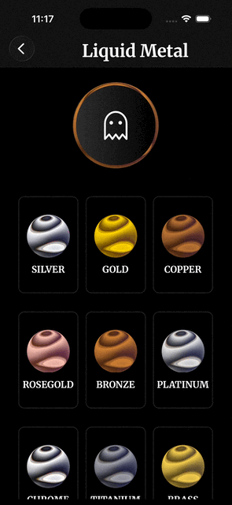

# Liquid Metal Shader

React Native Skia shader components that render animated liquid metal effects with
customizable shapes, colors, chromatic aberration, and iridescence.

This README covers the two shader components that share the `ExpoLiquidMetal` SkSL
source:

- **`ExpoLiquidMetalShader`** — liquid metal on a rectangle/pill/circle canvas, with
  iridescence, a chrome rim bevel, brightness lift, an optional refraction bubble, and
  a rounded-rect corner clip (`borderRadius`).
- **`SvgLiquidMetalShader`** — the same metal clipped to an arbitrary SVG path, with a
  3D bevel (shadow + highlight layers).



---

## Required Libraries

```bash
npx expo install @shopify/react-native-skia react-native-reanimated
# or
npm install @shopify/react-native-skia react-native-reanimated
```

**Setup `react-native-reanimated`** in your `babel.config.js`:

```js
module.exports = {
  presets: ["babel-preset-expo"],
  plugins: ["react-native-reanimated/plugin"],
};
```

---

## How It Works

1. **Component mounts** → the SkSL shader compiles via `Skia.RuntimeEffect.Make()`
2. **Clock starts** → `useClock()` provides continuous time updates
3. **Uniforms update** → `useDerivedValue()` recalculates shader inputs each frame
4. **GPU renders** → Skia draws the liquid metal effect at 60fps

Both components use **Perlin noise** (quintic interpolation) for organic distortion and
**chromatic aberration** (offset R/B channels) for the rainbow edge fringing seen in real
liquid metal reflections.

---

## `ExpoLiquidMetalShader`

Liquid metal on a rectangular canvas. Supports 5 shape modes, iridescence, a polished rim
bevel, a brightness/shadow lift, an optional glass **refraction bubble**, and a rounded-rect
corner clip via `borderRadius`.

<video src="../../../assets/videos/liquid_metal_button.mp4" width="300" controls></video>

### Usage

```tsx
import { ExpoLiquidMetalShader } from "@/components/liquid-metal/ExpoLiquidMetalShader";

// Iridescent silver disc
<ExpoLiquidMetalShader width={200} height={200} metal="silver" iridescence={0.5} />

// Chrome pill (rounded-rect) with a matching inset refraction bubble
<ExpoLiquidMetalShader
  shape={0}                       // full-fill so the corner clip is visible
  width={300}
  height={75}
  borderRadius={40}               // rounded corners (clipped inside the shader)
  metal="custom"
  customHighlight={[1, 1, 1]}
  customShadow={[0.12, 0.13, 0.16]}
  rimLight={1}                    // bright polished edge bevel
  brightness={0.12}               // lift the dark floor toward chrome
  bubbleColor={[0, 0, 0]}
  bubbleOpacity={0.4}             // subtle dark glass tint
  // bubbleRadius omitted → bubble corner = borderRadius - bubblePadding (concentric)
/>

// No refraction bubble (metal renders directly, no offscreen layer)
<ExpoLiquidMetalShader shape={0} borderRadius={12} bubble={false} />
```

### Props

| Prop              | Type                                | Default            | Description                                                             |
| ----------------- | ----------------------------------- | ------------------ | ----------------------------------------------------------------------- |
| `width`           | `number`                            | `300`              | Canvas width (logical px)                                               |
| `height`          | `number`                            | `300`              | Canvas height (logical px)                                              |
| `borderRadius`    | `number`                            | `0`                | Rounded-rect corner radius, clipped inside the shader (AA'd corners)    |
| `shape`           | `0 \| 1 \| 2 \| 3 \| 4`             | `1`                | Shape mode (see [Shape Modes](#shape-modes))                            |
| `metal`           | `MetalPresetName`                   | `'silver'`         | Metal preset name, or `'custom'`                                        |
| `customHighlight` | `[number, number, number]`          | —                  | Highlight RGB 0-1 (required if `metal='custom'`)                        |
| `customShadow`    | `[number, number, number]`          | —                  | Shadow RGB 0-1 (required if `metal='custom'`)                           |
| `colorBack`       | `[number, number, number, number]`  | `[0,0,0,0]`        | Background RGBA (0-1)                                                    |
| `colorTint`       | `[number, number, number, number]`  | `[1,1,1,0]`        | Tint color for the color-burn effect (alpha = intensity)                |
| `softness`        | `number`                            | `0`                | Blur/softness (0-1)                                                     |
| `repetition`      | `number`                            | `3`                | Stripe count (1-20)                                                     |
| `shiftRed`        | `number`                            | `0.3`              | Red chromatic shift (0-1)                                               |
| `shiftBlue`       | `number`                            | `0.3`              | Blue chromatic shift (0-1)                                              |
| `distortion`      | `number`                            | `0.07`             | Noise distortion (0-1)                                                  |
| `contour`         | `number`                            | `0.3`              | Edge sharpness (0-1)                                                    |
| `angle`           | `number`                            | `30`               | Pattern rotation (degrees); also drifts slowly over time               |
| `speed`           | `number`                            | `1`                | Animation speed multiplier                                             |
| `iridescence`     | `number`                            | `0`                | Iridescence intensity (0-1)                                             |
| `iridColors`      | `[RGB, RGB, RGB, RGB, RGB, RGB]`    | rainbow spectrum   | Six color stops for the iridescence rainbow                            |
| `rimLight`        | `number`                            | `0`                | Rim bevel brightness (0-1) — thin bright band just inside the outline  |
| `brightness`      | `number`                            | `0`                | Shadow lift (0-1) — screen-blends toward white, raising the dark floor |
| `bubble`          | `boolean`                           | `true`             | Render the refraction bubble layer. `false` = metal only (no DPR pass) |
| `bubbleColor`     | `[number, number, number]`          | `[1,1,1]`          | Glass tint color for the bubble (RGB 0-1)                              |
| `bubbleOpacity`   | `number`                            | `0`                | Glass tint strength (0 = clear refraction, 1 = solid color)            |
| `bubbleRadius`    | `number`                            | derived            | Bubble size. For `shape=0` it's the **corner radius**; otherwise the **radius**. See below. |
| `bubblePadding`   | `number`                            | `10`               | Inset (px) between the metal edge and the bubble                       |

**Refraction bubble.** When `bubble` is `true`, a glass lens (the `BShader` refraction
shader) is composited over the metal. It **inherits the metal's shape**, inset by
`bubblePadding`:

- `shape=0` (pill / rounded-rect) → the bubble is a concentric rounded rect. Its corner
  radius defaults to `borderRadius - bubblePadding` (curves stay parallel to the pill), or
  you can override it with `bubbleRadius`.
- any other shape → the bubble is a circle, radius `min(width, height) / 2 - bubblePadding`
  (or `bubbleRadius`).

---

## `SvgLiquidMetalShader`

The same liquid metal clipped to a custom SVG path, with a soft 3D bevel (a blurred dark
shadow layer bottom-right and a light highlight layer top-left). The path is auto-scaled and
centered within the canvas; a 15px canvas padding prevents the bevel blur from clipping.

Internally it forces `iShape=0` (full-fill) and lets the path clip do the shaping, so the
`shape`, `borderRadius`, `rimLight`, `brightness`, and bubble props do **not** apply here.

<video src="../../../assets/videos/morphing_liquid_metal.mp4" width="300" controls></video>

### Usage

```tsx
import { SvgLiquidMetalShader } from "@/components/liquid-metal/SvgLiquidMetalShader";

const LOGO_PATH = "M9.477 7.638c.164-.24.343-.27.488-.27...z";

<SvgLiquidMetalShader
  svgPath={LOGO_PATH}
  viewBoxWidth={20}
  viewBoxHeight={20}
  width={200}
  height={200}
  metal="gold"
  iridescence={0.3}
/>;
```

### Props

| Prop              | Type                                | Default          | Description                                          |
| ----------------- | ----------------------------------- | ---------------- | ---------------------------------------------------- |
| `svgPath`         | `string`                            | — (required)     | SVG path string (the `d` attribute)                  |
| `viewBoxWidth`    | `number`                            | `20`             | Original SVG viewBox width                           |
| `viewBoxHeight`   | `number`                            | `20`             | Original SVG viewBox height                          |
| `width`           | `number`                            | `300`            | Canvas width (logical px)                            |
| `height`          | `number`                            | `300`            | Canvas height (logical px)                           |
| `metal`           | `MetalPresetName`                   | `'silver'`       | Metal preset name, or `'custom'`                     |
| `customHighlight` | `[number, number, number]`          | —                | Highlight RGB 0-1 (required if `metal='custom'`)     |
| `customShadow`    | `[number, number, number]`          | —                | Shadow RGB 0-1 (required if `metal='custom'`)        |
| `colorBack`       | `[number, number, number, number]`  | `[0,0,0,0]`      | Background RGBA (0-1)                                 |
| `colorTint`       | `[number, number, number, number]`  | `[1,1,1,0]`      | Tint color for the color-burn effect                 |
| `softness`        | `number`                            | `0`              | Blur/softness (0-1)                                  |
| `repetition`      | `number`                            | `2`              | Stripe count (1-20)                                  |
| `shiftRed`        | `number`                            | `0.3`            | Red chromatic shift (0-1)                            |
| `shiftBlue`       | `number`                            | `0.3`            | Blue chromatic shift (0-1)                           |
| `distortion`      | `number`                            | `0.07`           | Noise distortion (0-1)                               |
| `contour`         | `number`                            | `0.3`            | Edge sharpness (0-1)                                 |
| `angle`           | `number`                            | `30`             | Pattern rotation (degrees)                           |
| `speed`           | `number`                            | `1`              | Animation speed multiplier                          |
| `iridescence`     | `number`                            | `0`              | Iridescence intensity (0-1)                          |
| `iridColors`      | `[RGB, RGB, RGB, RGB, RGB, RGB]`    | rainbow spectrum | Six color stops for the iridescence rainbow          |

---

## Reference

### Shape Modes

Applies to `ExpoLiquidMetalShader` (`shape` prop). `SvgLiquidMetalShader` always uses the
path as its shape.

| Value | Shape     | Description                           |
| ----- | --------- | ------------------------------------- |
| `0`   | Full-fill | Fills the canvas (use with `borderRadius` for a pill) |
| `1`   | Circle    | Centered circular shape               |
| `2`   | Daisy     | Flower/petal pattern (animated)       |
| `3`   | Diamond   | Rotated square                        |
| `4`   | Metaballs | Animated blob shapes                  |

### Metal Presets

| Preset     | Highlight            | Shadow               | Description             |
| ---------- | -------------------- | -------------------- | ----------------------- |
| `silver`   | `[0.98, 0.98, 1.0]`  | `[0.10, 0.10, 0.10]` | Classic metallic silver |
| `gold`     | `[1.0, 0.84, 0.0]`   | `[0.40, 0.25, 0.0]`  | Warm yellow gold        |
| `copper`   | `[0.72, 0.45, 0.20]` | `[0.25, 0.12, 0.05]` | Reddish-brown copper    |
| `roseGold` | `[0.98, 0.76, 0.70]` | `[0.35, 0.15, 0.12]` | Pink-tinted gold        |
| `bronze`   | `[0.80, 0.50, 0.20]` | `[0.30, 0.15, 0.05]` | Antique bronze          |
| `platinum` | `[0.90, 0.89, 0.88]` | `[0.15, 0.15, 0.17]` | Cool silvery-white      |
| `chrome`   | `[1.0, 1.0, 1.0]`    | `[0.05, 0.05, 0.05]` | High-contrast chrome    |
| `titanium` | `[0.62, 0.62, 0.65]` | `[0.12, 0.12, 0.15]` | Dark gunmetal           |
| `brass`    | `[0.95, 0.80, 0.30]` | `[0.35, 0.28, 0.08]` | Warm yellow brass       |

Use presets directly:

```tsx
import {
  METAL_PRESETS,
  getMetalColors,
  interpolateMetalColors,
} from "@/lib/shaders/ColorsLiquidMetal";

const goldColors = getMetalColors("gold");
const blended = interpolateMetalColors("silver", "gold", 0.5); // for animations
```

---

## Shader Architecture

### Iridescence

Rainbow colors that follow the wave motion, appearing at stripe transition edges (where dark
meets light):

```
Stripe Position → Rainbow Hue → Edge Detection → Blend with Metal
       │               │               │                │
   direction      6 color stops   stripe edges     iIridescence
   + noise        (configurable)   (dark/light)      intensity
```

### Chromatic Aberration

```
R channel: direction + dispersionRed   (shifts one way)
G channel: direction                    (no shift)
B channel: direction - dispersionBlue  (shifts opposite)
```

### Refraction Bubble (`ExpoLiquidMetalShader`)

The bubble layer (`BShader`) is a glass lens with barrel distortion, a prismatic rim, and a
specular glint. It supports two shapes via a `u_shape` uniform — **circle** or **rounded
rect** — so it can inherit the metal's pill shape. The metal renders in logical space while
the bubble layer runs at device resolution (a DPR scale trick) so the rim stays crisp.

---

## File Structure

```
src/
├── components/liquid-metal/
│   ├── ExpoLiquidMetalShader.tsx   # Rect/pill/circle metal + iridescence + bubble + borderRadius
│   ├── SvgLiquidMetalShader.tsx    # Metal clipped to a custom SVG path (3D bevel)
│   └── README.md                   # This file
│
├── components/wabi-and-more/
│   └── BShader.ts                  # Refraction bubble shader (circle / rounded-rect)
│
└── lib/shaders/
    ├── ExpoLiquidMetal.ts          # Perlin metal SkSL (iridescence + rounded-rect clip)
    └── ColorsLiquidMetal.tsx       # Metal color presets and helpers
```

---

## Attribution

Ported from [paper-design/shaders](https://github.com/paper-design/shaders).

**License:** PolyForm Shield License 1.0.0 — personal/educational use and mobile apps
allowed; creating competing shader libraries is not.

This variant differentiates from the original by using Perlin noise, customizable metal
presets, iridescence, a refraction bubble, and a rounded-rect corner clip.
