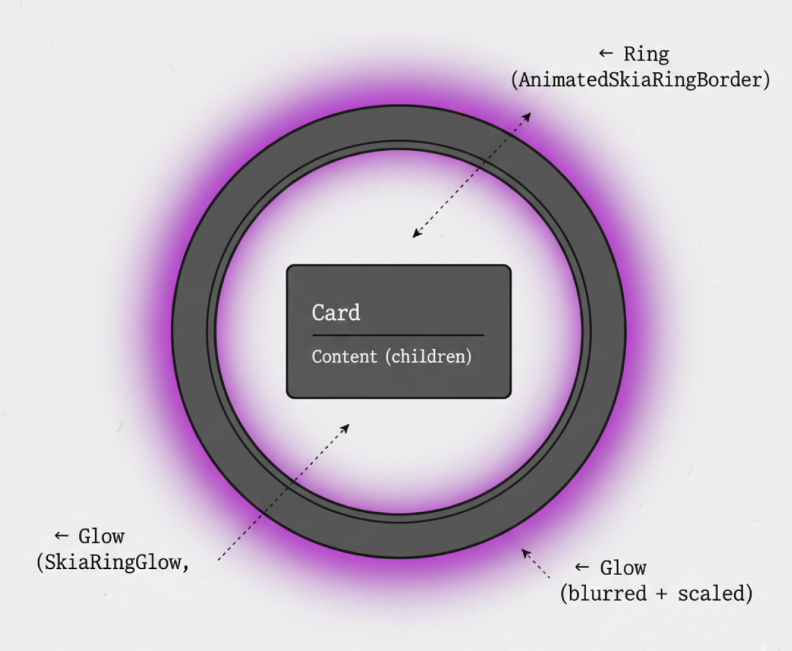

# Live Border Card

A collection of React Native components that render animated glowing borders around cards using Skia and Reanimated. Features rotating color gradients, customizable glow effects, and pulsating animations.

---

## Required Libraries

```bash
bun add @shopify/react-native-skia react-native-reanimated react-native-svg
# or
npx expo install @shopify/react-native-skia react-native-reanimated react-native-svg
```


---

## How It Works

### Animation Flow

1. **Component mounts** → `useSharedValue(0)` initializes rotation at 0 degrees
2. **Rotation starts** → `withRepeat(withTiming(360))` creates infinite clockwise rotation
3. **Ring renders** → `PathOp.Difference` subtracts inner rounded rect from outer to create ring clip
4. **Gradient fills ring** → `SweepGradient` with a rotation matrix fills the clipped ring shape
5. **Glow renders** → A blurred, scaled copy of the ring renders behind the card
6. **User sees** → A card with an animated color border and ambient glow

### Key Concepts

| Concept | Description |
|---------|-------------|
| `PathOp.Difference` | Subtracts inner path from outer to create a ring/donut shape |
| `SweepGradient` | Radial color gradient that sweeps 360 degrees around a center point |
| `rotation matrix` | Skia matrix transform that rotates the gradient for animation |
| `innerPadding` | Gap between outer card edge and inner content, determines ring thickness |
| `glowSpread` | Scale factor for how far the glow extends beyond the card (1 = same size) |
| `uniformColors` | When true, each color occupies a hard-edged segment instead of blending |
| `layer` prop | Skia `<Group layer={...}>` applies effects (blur) to all children |

### Component Variants

| Component | Purpose | Glow | Animation | Children |
|-----------|---------|------|-----------|----------|
| `AdaptableSkiaLiveBorderCard` | Main card with ring border + glow | Yes | Rotation + pulse | Yes |
| `LiveBorderCard` | Legacy card using color wheel wedges | Yes | Rotation | No (play/pause button) |
| `SkiaRingBorder` | Static ring border with gradient | No | Via `rotation` prop | No |
| `AnimatedSkiaRingBorder` | Animated ring border with SharedValue | No | Via SharedValue | No |
| `SkiaRingGlow` | Blurred ring for ambient glow effect | Yes (is the glow) | Rotation + pulse | No |

---

## Usage

### Basic Example

```tsx
import AdaptableSkiaLiveBorderCard from "@/components/live-border-card/AdaptableSkiaLiveBorderCard";

<AdaptableSkiaLiveBorderCard
  width={300}
  height={150}
  colors={["#4285F4", "#DB4437", "#F4B400", "#0F9D58"]}
/>
```

### With Custom Content and Glow

```tsx
import AdaptableSkiaLiveBorderCard from "@/components/live-border-card/AdaptableSkiaLiveBorderCard";
import { LinearGradient } from "expo-linear-gradient";
import { Text } from "react-native";

<AdaptableSkiaLiveBorderCard
  width={350}
  height={80}
  borderRadius={40}
  colors={["#1E3163", "#2D46B9", "#F037A5", "#F8F8F8"]}
  showGlow={true}
  glowIntensity={0.8}
  glowSpread={1.3}
  glowBlurRadius={20}
  duration={2000}
>
  <LinearGradient
    style={{ width: "100%", height: "100%" }}
    colors={["#2E2E2E", "#000000"]}
    start={{ x: 0, y: 0 }}
    end={{ x: 0, y: 1 }}
  >
    <Text style={{ color: "white", padding: 16 }}>Hello World</Text>
  </LinearGradient>
</AdaptableSkiaLiveBorderCard>
```

### With Pulsating Glow and Uniform Colors

```tsx
<AdaptableSkiaLiveBorderCard
  width={300}
  height={300}
  colors={["#5409DA", "#4E71FF", "#8DD8FF", "#BBFBFF"]}
  uniformColors={true}
  pulsateGlow={true}
  pulsateDuration={2000}
  pulsateMinOpacity={0.3}
  pulsateMaxOpacity={1.0}
/>
```

### Using SkiaRingBorder Standalone

```tsx
import { AnimatedSkiaRingBorder } from "@/components/live-border-card/SkiaRingBorder";
import { useEffect } from "react";
import { useSharedValue, withRepeat, withTiming, Easing } from "react-native-reanimated";

function MyComponent() {
  const rotation = useSharedValue(0);

  useEffect(() => {
    rotation.value = withRepeat(
      withTiming(360, { duration: 2500, easing: Easing.linear }),
      -1,
      false
    );
  }, []);

  return (
    <AnimatedSkiaRingBorder
      width={200}
      height={100}
      colors={["#FF8F8F", "#FFF1CB", "#C2E2FA", "#B7A3E3", "#FF8F8F"]}
      strokeWidth={8}
      borderRadius={16}
      rotation={rotation}
    />
  );
}
```

### Using the Color Wheel Components

```tsx
import { SVGColorWheel, SkiaColorWheel } from "@/components/live-border-card/ColorWheels";

// SVG implementation - static, pressable segments
<SVGColorWheel
  size={200}
  colors={["#FF6B6B", "#4ECDC4", "#45B7D1", "#96CEB4"]}
  curveAmount={0.2}
  onSegmentPress={(index, color) => console.log(index, color)}
/>

// Skia implementation - GPU-accelerated, elliptical support
<SkiaColorWheel
  width={300}
  height={200}
  colors={["#FF6B6B", "#4ECDC4", "#45B7D1", "#96CEB4"]}
  innerRadius={0.3}
/>
```

---

## Props

### AdaptableSkiaLiveBorderCard Props

| Prop | Type | Default | Description |
|------|------|---------|-------------|
| `width` | `number` | required | Total card width in pixels |
| `height` | `number` | required | Total card height in pixels |
| `colors` | `string[]` | required | Array of colors for the border gradient |
| `duration` | `number` | `2000` | Full rotation duration in ms |
| `borderRadius` | `number` | `16` | Border radius for rounded corners |
| `innerPaddingPercentage` | `number` | `0.05` | Ring thickness as percentage of smaller dimension |
| `showGlow` | `boolean` | `true` | Whether to render the glow effect |
| `glowIntensity` | `number` | `1` | Glow opacity (0-1) |
| `glowSpread` | `number` | `1.5` | How much glow extends beyond card (1 = same size) |
| `glowBlurRadius` | `number` | `35` | Gaussian blur radius for glow |
| `uniformColors` | `boolean` | `false` | Use hard-edged color segments instead of gradient |
| `pulsateGlow` | `boolean` | `false` | Enable pulsating opacity + scale on glow |
| `pulsateDuration` | `number` | `2000` | One pulse cycle duration in ms |
| `pulsateMinOpacity` | `number` | `0.3` | Minimum opacity during pulse |
| `pulsateMaxOpacity` | `number` | `1.0` | Maximum opacity during pulse |
| `children` | `ReactNode` | - | Content rendered inside the card |

### SkiaRingBorder / AnimatedSkiaRingBorder Props

| Prop | Type | Default | Description |
|------|------|---------|-------------|
| `width` | `number` | required | Total width of the ring |
| `height` | `number` | required | Total height of the ring |
| `colors` | `string[]` | Google colors | Array of gradient colors (repeat first for seamless loop) |
| `strokeWidth` | `number` | required | Thickness of the ring |
| `borderRadius` | `number` | `0` | Corner rounding radius |
| `rotation` | `number \| SharedValue<number>` | `0` | Rotation angle in degrees (static or animated) |
| `backgroundColor` | `string` | `'transparent'` | Fill color inside the ring |
| `uniformColors` | `boolean` | `false` | Use hard-edged color segments |

### SkiaRingGlow Props

| Prop | Type | Default | Description |
|------|------|---------|-------------|
| `width` | `number` | required | Total glow area width |
| `height` | `number` | required | Total glow area height |
| `colors` | `string[]` | required | Array of gradient colors |
| `borderRadius` | `number` | required | Corner rounding radius |
| `strokeWidth` | `number` | required | Ring thickness |
| `blurRadius` | `number` | `30` | Gaussian blur radius |
| `opacity` | `number` | `0.8` | Base opacity (0-1) |
| `rotation` | `SharedValue<number>` | - | Animated rotation value in degrees |
| `uniformColors` | `boolean` | `false` | Use hard-edged color segments |
| `pulsate` | `boolean` | `false` | Enable pulsating animation |
| `pulsateDuration` | `number` | `2000` | One pulse cycle in ms |
| `pulsateMinOpacity` | `number` | `0.3` | Minimum pulse opacity |
| `pulsateMaxOpacity` | `number` | `1.0` | Maximum pulse opacity |

### SVGColorWheel Props

| Prop | Type | Default | Description |
|------|------|---------|-------------|
| `size` | `number` | `300` | Wheel diameter in pixels |
| `colors` | `string[]` | 8 default colors | Colors for each segment |
| `rotation` | `number` | `-90` | Starting rotation in degrees |
| `innerRadius` | `number` | `0` | Inner radius (0-1) for donut effect |
| `strokeWidth` | `number` | `0` | Stroke between segments |
| `strokeColor` | `string` | `'#fff'` | Stroke color |
| `curveAmount` | `number` | `0` | Edge curvature (0 = straight, 0.5 = pronounced) |
| `onSegmentPress` | `(index, color) => void` | - | Callback when segment is pressed |

### SkiaColorWheel Props

| Prop | Type | Default | Description |
|------|------|---------|-------------|
| `width` | `number` | `size` | Wheel width (supports elliptical) |
| `height` | `number` | `size` | Wheel height (supports elliptical) |
| `size` | `number` | `300` | Fallback for both width and height |
| `colors` | `string[]` | 8 default colors | Colors for each segment |
| `rotation` | `number` | `-90` | Starting rotation in degrees |
| `innerRadius` | `number` | `0` | Inner radius (0-1) for donut effect |
| `centerColor` | `string` | `'transparent'` | Color for donut hole center |

---

## Architecture

### Ring Creation (PathOp.Difference)

The ring shape is created by subtracting an inner rounded rectangle from an outer one:


```
Outer RRect          Inner RRect          Ring (Difference)
┌──────────────┐     ┌──────────────┐     ┌──────────────┐
│              │     │  ┌────────┐  │     │  ▓▓▓▓▓▓▓▓▓▓  │
│              │  -  │  │        │  │  =  │  ▓        ▓  │
│              │     │  │        │  │     │  ▓        ▓  │
│              │     │  └────────┘  │     │  ▓▓▓▓▓▓▓▓▓▓  │
└──────────────┘     └──────────────┘     └──────────────┘
```

### Gradient Rotation

The `SweepGradient` fills the ring with colors. A rotation matrix is applied each frame to animate:


```
Frame 0               Frame 1               Frame 2
┌──────────────┐      ┌──────────────┐      ┌──────────────┐
│  🔵🔵🔴🔴🔴  │      │  🟢🔵🔵🔴🔴  │      │  🟡🟢🔵🔵🔴  │
│  🔵        🔴  │      │  🟢        🔴  │      │  🟡        🔴  │
│  🟢        🟡  │  →  │  🔵        🟡  │  →  │  🟢        🟡  │
│  🟢🟢🟡🟡🟡  │      │  🟢🟢🟢🟡🟡  │      │  🔵🟢🟢🟡🟡  │
└──────────────┘      └──────────────┘      └──────────────┘
```

### Glow Layer

The glow is a scaled-up, blurred copy of the ring, rendered behind the card:



```
    ░░░░░░░░░░░░░░░░░░      ← Glow (SkiaRingGlow, blurred + scaled)
    ░  ▓▓▓▓▓▓▓▓▓▓▓▓  ░
    ░  ▓  ┌──────┐ ▓  ░      ← Ring (AnimatedSkiaRingBorder)
    ░  ▓  │ Card │ ▓  ░
    ░  ▓  │      │ ▓  ░      ← Content (children)
    ░  ▓  └──────┘ ▓  ░
    ░  ▓▓▓▓▓▓▓▓▓▓▓▓  ░
    ░░░░░░░░░░░░░░░░░░
```

### Uniform vs Gradient Colors


```
Gradient (default)           Uniform (uniformColors=true)
┌──────────────┐             ┌──────────────┐
│  🔵↔🔴↔🟡↔🟢  │             │🔵🔵|🔴🔴|🟡🟡|🟢🟢  │
│              │             │              │
│  Smooth      │             │  Hard edges  │
│  transitions │             │  between     │
│  between     │             │  segments    │
│  colors      │             │              │
└──────────────┘             └──────────────┘
```

---

## File Structure

```
src/
├── app/live-border-card/
│   ├── index.tsx                      # Demo page with controls
│   └── demo.tsx                       # Standalone demo with image background
│
├── components/live-border-card/
│   ├── AdaptableSkiaLiveBorderCard.tsx # Main card component (ring + glow + children)
│   ├── SkiaRingBorder.tsx             # Ring border (static + animated exports)
│   ├── SkiaRingGlow.tsx               # Blurred ring glow effect
│   ├── LiveBorderCard.tsx             # Legacy card using color wheel wedges
│   ├── ColorWheels.tsx                # SVG + Skia color wheel implementations
│   └── README.md                      # This file
```

---

## Future Enhancements

- [ ] **Touch interaction**: Glow intensifies or changes direction on press
- [ ] **Trim animation**: Animate a partial arc that travels around the ring
- [ ] **Multiple rings**: Stack rings with different rotation speeds
- [ ] **Image mask**: Use the ring as a mask for image-based gradients
