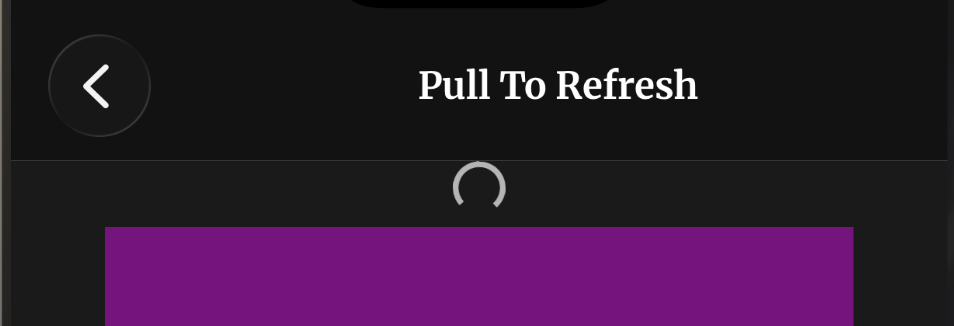
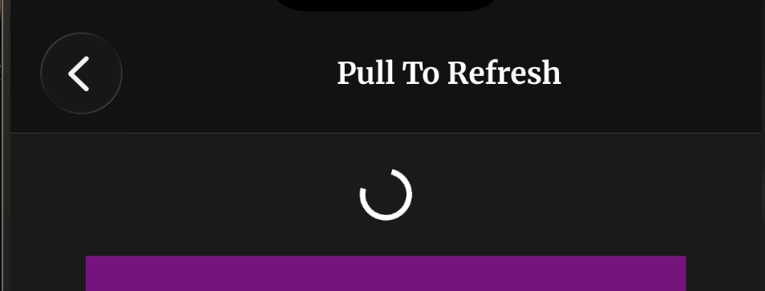
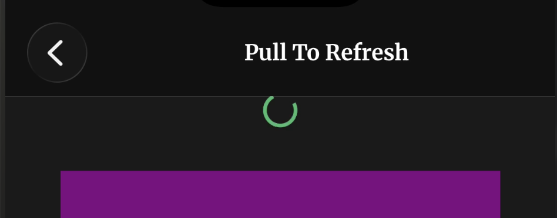

# PullToRefresh

A gesture-driven pull-to-refresh that renders any React element as the indicator, with switchable iOS and Android layout behaviours.

---

## Required Libraries

```bash
npx expo install react-native-reanimated react-native-gesture-handler react-native-worklets
```

**Wrap your app** in `GestureHandlerRootView` (Expo Router does this for you in the default template — verify before adding a second one):

```tsx
import { GestureHandlerRootView } from "react-native-gesture-handler";

export default function RootLayout() {
  return (
    <GestureHandlerRootView style={{ flex: 1 }}>
      {/* Your app */}
    </GestureHandlerRootView>
  );
}
```

---

## How It Works

### Why a pan gesture instead of scroll offset

The obvious implementation reads `contentOffset.y` and treats negative values
as pull distance — but that only works on iOS. Android's `ScrollView` clamps
its offset at `0` and never reports overscroll. So the pull is driven by a
`Gesture.Pan()` composed _simultaneously_ with the scroll view's own native
gesture instead; scroll offset is tracked only to answer one question — is the
list at the top? — which makes the behaviour identical on both platforms.

### The Three Stages

A refresh is not one animation, it's three, and an indicator usually wants to
draw each differently. The hook exposes them as a `phase` state machine plus a
driver value for each:

| Stage         | `phase`        | Driver                                          | Ends when                                  |
| ------------- | -------------- | ----------------------------------------------- | ------------------------------------------ |
| 1. Pull       | `"pulling"`    | `progress` rising `0 → 1`                       | the finger lifts                           |
| 2. Refreshing | `"refreshing"` | `spin` looping `0 → 1`                          | `onRefresh()` settles, or `timeoutMs` hits |
| 3. Settle     | `"settling"`   | `progress` falling `1 → 0`, tinted by `outcome` | the spring lands → `"idle"`                |

**Stage 1 — pull.** The ring winds up as `progress` rises `0 → 1`.



**Stage 2 — refreshing.** Parked at the threshold, the ring loops at full size.



**Stage 3 — settle.** The ring springs closed, tinted by `outcome` — green on success (shown), red on error.



**Why stage 3 is its own phase.** `pullY` springs back to `0` both when a pull
is cancelled below the threshold and when a refresh finishes — identical from
`progress` alone. The separate phase is what lets an indicator play a distinct
exit (a checkmark, a colour flush) that a cancelled pull must _not_ trigger: a
cancel returns straight to `"idle"`; only a completed refresh passes through
`"settling"`.

### Interaction Flow

1. **User drags down** → `onScroll` has `scrollY <= 0`, so `pullY` follows `translationY`; `phase` → `"pulling"`
2. **`pullY` rises** → `progress` interpolates `0 → 1` over `PULL_DISTANCE` (80pt)
3. **Release past threshold** → `phase` → `"refreshing"`, `pullY` springs to `PULL_DISTANCE` and _stays_ there holding `progress` at 1, `spin` starts looping
4. **`handleRefresh` runs** on the JS thread via `scheduleOnRN` and awaits `onRefresh(signal)`, racing it against `timeoutMs`
5. **Work settles** → `outcome` → `"success"` or `"error"`, `phase` → `"settling"`, `pullY` springs back to `0`
6. **Spring lands** → `phase` → `"idle"`, `spin` is cancelled and reset
7. **Throughout 3–6** → `phase` gates both gesture callbacks, so a second pull cannot start

Released _below_ the threshold instead? `phase` → `"idle"` immediately and
`pullY` springs back. No stage 2, no stage 3.

### Key Concepts

| Concept                | Description                                                                                                                                                |
| ---------------------- | ---------------------------------------------------------------------------------------------------------------------------------------------------------- |
| `pullY`                | Raw drag distance in points. The only value the gesture writes.                                                                                            |
| `progress`             | Derived, normalized: 0 = at rest, 1 = threshold reached or refreshing. Drives stages 1 and 3.                                                              |
| `phase`                | The state machine: `idle` → `pulling` → `refreshing` → `settling` → `idle`                                                                                 |
| `spin`                 | Stage-2 driver. A **sawtooth** 0→1 that snaps back at the top, so it maps to rotation or a sweep without a reversal hitch. Parked at 0 outside stages 2–3. |
| `outcome`              | How the last refresh ended: `none` / `success` / `error`. Committed before stage 3 starts, so the exit can differ.                                         |
| `PULL_DISTANCE`        | 80pt — both the trigger threshold and the 100% mark for `progress`                                                                                         |
| `MIN_REFRESH_DURATION` | 900ms floor on stage 2, so an instant `onRefresh` doesn't flash the loop for two frames                                                                    |
| `REFRESH_TIMEOUT`      | 15s ceiling on stage 2. Without it a hung request gates the gesture forever.                                                                               |
| `Gesture.Simultaneous` | Lets the pan coexist with the scroll view's native gesture rather than stealing it                                                                         |

`phase` lives in a **shared value**, not React state — worklets snapshot JS
values when they're created, so React state would go stale inside the gesture
callbacks. It also doubles as the gesture gate, which is why there's no
separate `isRefreshing` mirror: one state machine, not a boolean plus three
implicit states.

### The Two Layout Models

`layout` is the single most important prop, because it changes **where the
indicator must be mounted**. `PullToRefresh` handles this for you; using
`CustomChildRefreshIndicator` directly, you must get it right.

```
  layout="inset"  (iOS)              layout="overlay"  (Android)

  ┌──────────────────┐               ┌──────────────────┐
  │ ▓▓ indicator ▓▓  │ ← grows       │ ▓▓ indicator ▓▓  │ ← fixed box,
  ├──────────────────┤   0 → 66pt    │ ░░ item 1 ░░░░░░ │   floats on top
  │ ░░ item 1 ░░░░░░ │ ← pushed      │ ░░ item 2 ░░░░░░ │
  │ ░░ item 2 ░░░░░░ │   down        │ ░░ item 3 ░░░░░░ │ ← never moves
  └──────────────────┘               └──────────────────┘

  first child OF the ScrollView      SIBLING of the ScrollView
```

Mounting an `overlay` indicator _inside_ the scroll view is the classic bug: it
scrolls away with the content instead of staying pinned to the viewport.

### Layout vs. Shape

`layout` and `indicatorType` are deliberately separate props:

- `layout` — the **behaviour** (`inset` pushes, `overlay` floats)
- `indicatorType` — the **shape** (`ios` = full-width bar, `android` = 66pt circle with shadow)

They usually pair as `ios`/`inset` and `android`/`overlay`, but keeping them
independent lets you preview one platform's visual on the other, or mix freely.

---

## Usage

### Basic Example

The demo wires everything together, with a control bar under the list for
comparing configurations at runtime:

- **Type** — the indicator shape, `ios` bar or `android` circle
- **Layout** — `inset` vs `overlay`; dimmed while a sticky header is on, which
  forces `overlay` (see
  [Driving a Sticky Header](#driving-a-sticky-header-from-the-lifecycle))
- **Sticky** — `off`, `bar` (the lifecycle-driven status bar), `threads` (the
  Threads-glyph header over a feed of post cards — see
  [The Threads Example](#the-threads-example)), or `neon` (an **experimental**
  variant of the glyph header in neon colours over a flashing feed — see
  [The Neon Example](#the-neon-example-experimental))

The toggles live in `PullToRefresh`, but the indicator must stay a prop-less
module-level component (its `ListHeaderComponent` identity must never change),
so the config reaches it through a small demo-local context — the same trick
the lifecycle itself uses.

The demo's `onRefresh` fakes work with a 2s timeout; the hook is agnostic
about what the work really is (see
[Real-World Fetching](#real-world-fetching)). A `SIMULATE_FAILURE` constant in
[`PullToRefresh.tsx`](./PullToRefresh.tsx) makes the fake refresh reject, so
you can watch the error path without unplugging the network.

### With a Custom Indicator Child

`CustomChildRefreshIndicator` renders whatever you give it and only supplies the
container, the layout behaviour, and the reveal animation. The child reads the
stage values itself:

```tsx
const { progress, phase, spin, outcome, gesture, onScrollHandler } =
  useCustomRefreshControl({ onRefresh: refetch });

<CustomChildRefreshIndicator
  progress={progress}
  indicatorType="ios"
  layout="inset"
  revealMode="translateY"
>
  <RefreshSpinner
    progress={progress}
    phase={phase}
    spin={spin}
    outcome={outcome}
  />
</CustomChildRefreshIndicator>;
```

### Animating All Three Stages

The demo's `RefreshSpinner` covers every stage in a single `useAnimatedStyle`,
because the drivers are orthogonal: `progress` owns _presence_ (scale, opacity)
in stages 1 and 3, and `phase` only decides which value feeds the rotation.

```tsx
const spinnerStyle = useAnimatedStyle(() => {
  // Stage 1 winds the arc up by hand; stages 2 and 3 hand it to the loop.
  // Settling stays on `spin` so the ring never freezes mid-exit.
  const rotation =
    phase.value === "pulling" || phase.value === "idle"
      ? progress.value * 270 // stage 1: wind up with the drag
      : spin.value * 360; // stages 2 & 3: free-running loop

  return {
    opacity: progress.value, // fades in on 1, out on 3
    transform: [
      { scale: interpolate(progress.value, [0, 1], [0.4, 1]) },
      { rotate: `${rotation}deg` },
    ],
  };
});
```

To give stage 3 a genuinely distinct exit rather than just running stage 1 in
reverse, branch on `phase.value === "settling"` — that's the whole reason the
phase exists:

```tsx
const isSettling = phase.value === "settling";
return {
  opacity: progress.value,
  transform: [{ scale: isSettling ? progress.value * 1.4 : progress.value }],
  // e.g. flush to green and pop outward on success, instead of collapsing
};
```

### Wiring the Layout Correctly

```tsx
<View style={styles.container}>
  {/* overlay: sibling of the list, pinned to the viewport */}
  {layout === "overlay" && indicator}

  <GestureDetector gesture={gesture}>
    <Animated.FlatList
      data={items}
      renderItem={({ item }) => <Row item={item} />}
      keyExtractor={(item) => item.id}
      // inset: the header slot, in flow, so its height pushes rows down
      ListHeaderComponent={layout === "inset" ? indicator : null}
      onScroll={onScrollHandler}
      scrollEventThrottle={16}
    />
  </GestureDetector>
</View>
```

With a plain `Animated.ScrollView`, the `inset` indicator is simply the first
child instead.

### Gotcha: percentage widths inside a FlatList

`FlatList` wraps every row in a cell view that `ScrollView` does not. So this,
which works fine on a `ScrollView`, silently renders **zero-width rows** on a
`FlatList`:

```tsx
contentContainerStyle={{ alignItems: "center" }}   // ✗ makes cells width-auto
rowStyle={{ width: "80%" }}                        // ✗ 80% of undefined = 0
```

`alignItems: "center"` sizes each cell to its content; the row's `80%` then
resolves against an undefined parent width and collapses. Fixed heights still
apply, so the list scrolls normally and looks _empty_ rather than broken. Let
cells stretch and centre the row itself:

```tsx
contentContainerStyle={{ /* no alignItems */ }}
rowStyle={{ width: "80%", alignSelf: "center" }}   // ✓
```

The same applies to the `inset` indicator, whose container is `width: "100%"`.

### Gotcha: `gap` counts the header as a child

Row spacing comes from an `ItemSeparatorComponent`, not a `gap` on
`contentContainerStyle`. The inset indicator is a child of the content
container (it's the `ListHeaderComponent`), so `gap` inserts spacing between
it and the first row even while the indicator is 0pt tall — a mystery strip of
empty space that only appears in `inset` mode. Separators render only
_between_ rows, never after the header. The flip side: a sticky header must
supply its own gap to the first row, via `marginBottom` in its own style.

### Driving a Sticky Header From the Lifecycle

Keeping a sticky header and having it reflect the refresh is a first-class case
— `RefreshLifecycleContext` exists for it. The demo's implementation lives in
[`StickyHeader.tsx`](./StickyHeader.tsx). Three things make it work:

**1. The header takes no props.** `ListHeaderComponent` re-mounts whenever its
identity changes, and a re-mounting _sticky_ header visibly flickers as it
loses its pinned position for a frame. An inline element
(`ListHeaderComponent={<Header progress={progress} />}`) is a new identity
every render; reading from context keeps the header a module-level reference
that never changes:

```tsx
function StickyStatusHeader() {
  const { progress, phase, spin, outcome } = useRefreshLifecycle();
  // ...
}

<Animated.FlatList
  ListHeaderComponent={StickyStatusHeader} // component, not element
  stickyHeaderIndices={[0]}
/>;
```

This costs nothing at runtime: every context value is a `SharedValue` with a
stable identity, so the context value never changes and no consumer ever
re-renders — the header animates on the UI thread off the same values the
indicator uses.

**2. Only index `0` is a safe sticky index.** With `ListHeaderComponent`
present it is child 0 of the underlying `ScrollView`. Row indices are not
stable — `VirtualizedList` inserts spacer views as you scroll, which shifts
them out from under you.

**3. A sticky header and the `inset` indicator are mutually exclusive.** They
compete for the same slot, and more fundamentally the `inset` indicator's
_height is the animation_ — an animating sticky height moves the list's sticky
offset every frame. So a sticky header pushes the indicator out to the
`overlay` mount (the demo's derived `effectiveLayout`, and why the Layout
toggle dims while Sticky is on).

For text that changes per stage, hop to JS deliberately — a one-frame lag is
fine for a label, never for motion:

```tsx
const [label, setLabel] = useState("Latest");

useAnimatedReaction(
  () => phase.value,
  (current, previous) => {
    if (current === previous) return;
    scheduleOnRN(setLabel, STATUS_LABEL[current]);
  },
);
```

Note the `current === previous` guard: `useAnimatedReaction` fires on every
frame the prepare block runs, not only on change.

### The Threads Example

`Sticky = threads` swaps the demo's abstract look for a small Threads clone —
the worked example of a sticky header _and_ a real feed both hanging off the
same lifecycle. It lives in [`threads-example/`](./threads-example) and has
three parts:

**1. The glyph header — [`ThreadsView.tsx`](./threads-example/ThreadsView.tsx).**
Mounted exactly like `StickyStatusHeader` (prop-less, reads
`useRefreshLifecycle()`, sits at index 0), but instead of a text label it draws
the Threads glyph on a Skia canvas via the pure presentational
[`ThreadsSpotlight`](./threads-example/ThreadsSpotlight.tsx), mapping each phase
onto the drawing:

- `pulling` → a gradient bead rides the glyph, its position driven by `progress`
- `refreshing` → the bead ping-pongs tip-to-tip on its own clock
- `settling` → the bead folds away at the tip it was heading for, then the glyph
  draws itself in white with an accent sweep (yellow on success, red on error)
- `idle` → the white fill _holds_ until the next pull, so a refreshed glyph
  reads as "fresh"

Same rules as any sticky header: fixed height (the pull animates the header's
_contents_, never its box) and opaque background (rows scroll underneath it).

**2. The post card — [`ThreadItemView.tsx`](./threads-example/ThreadItemView.tsx).**
A pure presentational row that takes a `ThreadPost` and lays out a Threads
post: avatar, handle + timestamp, body, an optional image rail, the action bar
(counts formatted `1200 → 1.2K`), and an optional inline first reply — with the
avatar column doubling as the thread line to the reply. Feed data is fixed mock
content in [`posts.ts`](./threads-example/posts.ts), cycled with `postForIndex`.

**3. The refresh illusion — reshuffling on success.** A real pull-to-refresh
shows new content when it's done; the demo fakes that by **reordering the feed**
on a successful refresh. The row order is React state, and `onRefresh` reshuffles
it _after_ the awaited work resolves:

```tsx
const [feedOrder, setFeedOrder] = useState(ITEMS);

const onRefresh = async (signal) => {
  await fakeFetch(signal); // a rejection throws here and skips the reshuffle
  setFeedOrder(reshuffle); // success only → the settle reveals a new order
};

<Animated.FlatList data={feedOrder} keyExtractor={(item) => `${item}`} />;
```

Two details make it read right:

- **Reshuffle on success only.** A rejected refresh throws out of the `await`
  before `setFeedOrder`, so a failed pull leaves the order untouched.
- **`reshuffle` never returns the input order.** It's a Fisher–Yates retried
  until the result differs, so every refresh _visibly_ reshuffles.

Because it reshuffles _while the indicator is still held open_, the settle is
what reveals the new order, and stable keys mean `FlatList` reorders cells
rather than remounting them. This is the demo's stand-in for the
[real prepend-at-top case](#data-landing-during-stage-3).

### The Neon Example (experimental)

> ⚠️ **Work in progress.** `Sticky = neon` is a scratch exploration, not a
> finished demo — it's here to prototype driving `ThreadsSpotlight` with
> arbitrary vector art and to react the _rows_ (not just the header) to the
> refresh. Expect rough edges; the specifics below will change.

It reuses the exact Threads machinery with two twists:

- **[`NeonView.tsx`](./neon-example/NeonView.tsx)** — the same glyph sticky
  header as `ThreadsView`, but feeding `ThreadsSpotlight` a different path and a
  neon colour ramp ([`NEON_COLORS`](./constants.ts)). It's the testbed for
  driving the spotlight with **text turned into monolines** — Skia paragraphs
  exploded into per-contour paths via
  [`textGlyphPaths.ts`](./threads-example/textGlyphPaths.ts) — including an
  RTL sweep for Arabic (contours sorted rightmost-first, since a font hands them
  back in logical, not spatial, order). Today the live render points at a
  placeholder test path while that wiring is tuned.
- **[`NeonItemView.tsx`](./neon-example/NeonItemView.tsx)** — rows that
  **pulse on a successful refresh**. Each row reads the lifecycle
  (`useRefreshLifecycle`) and, via a `useAnimatedReaction` on
  `phase === "settling" && outcome === "success"`, fires a `withDelay(index * …)`
  ripple down the list.

**Known rough edge:** the ripple is meant to cascade top-to-bottom, but it fires
on the same event that reshuffles the feed — so each row schedules its delay from
its _pre-shuffle_ index while the reshuffle moves it elsewhere, and the wave
reads as random. The fix is to stop the two racing (reshuffle at refresh
_start_, or delay the ripple until after the reorder commits) so the delays key
off the layout you actually watch it on.

### Hook Only

The hook has no opinion about rendering, so you can drive any visual with it —
a Skia canvas, a Lottie file, a rotating icon. `onRefresh` is **awaited**, so
stage 2 lasts exactly as long as your work does:

```tsx
const { progress, phase, spin, outcome, error, gesture, onScrollHandler } =
  useCustomRefreshControl({
    onRefresh: async () => {
      await queryClient.invalidateQueries({ queryKey: ["feed"] });
    },
  });
```

---

## Real-World Fetching

Awaiting `onRefresh` is necessary but not sufficient. Four things go wrong once
that promise is a real network call:

| Failure                                      | Handled by                                                                                                                                                                                    |
| -------------------------------------------- | --------------------------------------------------------------------------------------------------------------------------------------------------------------------------------------------- |
| The request **rejects**                      | `outcome` → `"error"`, plus `error` for a toast. Without it a failed refresh exits looking exactly like a successful one.                                                                     |
| The request **hangs**                        | `timeoutMs` (15s default). This is the dangerous one — the gesture is gated during stage 2, so an un-timed-out request leaves the list _permanently_ unrefreshable until the screen remounts. |
| The user **navigates away**                  | An `AbortSignal` is passed to `onRefresh`. Forward it.                                                                                                                                        |
| An **instant** failure (offline, cached 401) | `MIN_REFRESH_DURATION` applies to failures too, so the error state is on screen long enough to read.                                                                                          |

```tsx
const { progress, phase, spin, outcome, error } = useCustomRefreshControl({
  onRefresh: async (signal) => {
    const res = await fetch("/api/feed", { signal });
    if (!res.ok) throw new Error(`Feed request failed: ${res.status}`); // → "error"
    setFeed(await res.json());
  },
});
```

`fetch` **rejects with `AbortError` when the signal fires**, so the timeout
path lands in the same `catch` as any other failure — no separate handling
needed.

### Distinguishing failure in stage 3

`outcome` is committed _before_ the settle spring starts, so it's already
readable on the first frame of stage 3:

```tsx
const tint =
  outcome.value === "error"
    ? "#f87171"
    : outcome.value === "success"
      ? "#4ade80"
      : "#fff"; // stages 1 and 2 are always neutral
```

It resets to `"none"` when the next pull begins, not at the end of stage 3 — so
an indicator can keep showing the last result while idle if it wants to.

### Data landing during stage 3

If new rows mount while the indicator is still open, the list can jump. For a
feed that prepends at the top, the standard fix is:

```tsx
<Animated.FlatList maintainVisibleContentPosition={{ minIndexForVisible: 0 }} />
```

### Not handled: cancel on unmount

`onRefresh` is aborted on timeout, but **not** when the screen unmounts — that
needs a lifecycle hook, and this project bans bare `useEffect` (see the
`no-use-effect-native` rules). Use `useFocusEffect`, since an Expo Router
screen stays mounted in the stack when you navigate away:

```tsx
useFocusEffect(useCallback(() => () => controller.current?.abort(), []));
```

---

## Props

### `CustomChildRefreshIndicator`

| Prop              | Type                        | Default         | Description                                 |
| ----------------- | --------------------------- | --------------- | ------------------------------------------- |
| `progress`        | `SharedValue<number>`       | required        | Normalized pull progress, 0 to 1            |
| `children`        | `ReactNode`                 | required        | The indicator visual                        |
| `indicatorType`   | `"ios" \| "android"`        | required        | Shape: full-width bar or 66pt circle        |
| `layout`          | `"inset" \| "overlay"`      | `"inset"`       | Push content down, or float above it        |
| `revealMode`      | `"opacity" \| "translateY"` | `"opacity"`     | Fade in, or slide down from above (clipped) |
| `backgroundColor` | `string`                    | `"transparent"` | Background of the indicator box             |

### `useCustomRefreshControl({ onRefresh })`

| Param       | Type                                             | Default  | Description                                                                                                 |
| ----------- | ------------------------------------------------ | -------- | ----------------------------------------------------------------------------------------------------------- |
| `onRefresh` | `(signal: AbortSignal) => void \| Promise<void>` | required | The work. **Awaited** — stage 2 lasts as long as the promise does. Rejecting produces an `"error"` outcome. |
| `timeoutMs` | `number`                                         | `15000`  | Hard ceiling on stage 2                                                                                     |

| Returns           | Type                          | Description                                                                 |
| ----------------- | ----------------------------- | --------------------------------------------------------------------------- |
| `progress`        | `SharedValue<number>`         | 0 at rest, 1 when pulled to threshold or refreshing. Drives stages 1 and 3. |
| `phase`           | `SharedValue<RefreshPhase>`   | `"idle" \| "pulling" \| "refreshing" \| "settling"`                         |
| `spin`            | `SharedValue<number>`         | Sawtooth 0→1 loop. Drives stage 2. Parked at 0 otherwise.                   |
| `outcome`         | `SharedValue<RefreshOutcome>` | `"none" \| "success" \| "error"` — committed before stage 3 starts          |
| `isRefreshing`    | `boolean`                     | React state, for non-animated UI                                            |
| `error`           | `Error \| null`               | The last failure, for a banner or toast                                     |
| `gesture`         | `ComposedGesture`             | Pass to `GestureDetector` wrapping the scroll view                          |
| `onScrollHandler` | `AnimatedScrollHandler`       | Pass to the scroll view's `onScroll`                                        |

---

## Implementation Notes

**Single source of truth.** The gesture writes exactly one value, `pullY`.
`progress` is a `useDerivedValue` on top of it and nothing else writes to it.
Holding `pullY` at `PULL_DISTANCE` during a refresh is what keeps `progress`
pinned at 1 — there is no separate "refreshing" branch in the interpolation.

**The phase flips on the UI thread, in `onEnd`.** Not inside `handleRefresh`.
`scheduleOnRN` takes a frame or two to land on the JS thread, and setting the
phase there would leave a window in which a fast second pull could slip through
the gate.

**Stage 3 ends via the spring's own callback**, which sets `"idle"` and cancels
the `spin` loop. The reset is deliberately _unconditional_ rather than gated on
`finished` — nothing else writes `pullY` while settling, so a non-finished
spring only means an unmount, and a phase stuck at `"settling"` would deadlock
the gesture permanently.

**`spin` keeps running through stage 3**, cancelled only once the phase reaches
`"idle"` — killing it the instant the work resolves would freeze the ring
mid-rotation while still visible and shrinking.

**Both reveal branches return the same style shape.** `opacity` mode returns
`{ opacity, transform: [{ translateY: 0 }] }` rather than just `{ opacity }`, so
Reanimated never reconciles a changing set of animated properties when the mode
is toggled.

**`overflow: "hidden"` on the container** is what makes the `translateY` reveal
work — the child starts at `-INDICATOR_SIZE` and is clipped until the space
opens.

**The losing side of the timeout race gets a no-op `.catch()`.** When the
deadline wins, the work promise is still in flight and will almost certainly
reject a moment later (`fetch` rejects with `AbortError` as soon as the signal
fires). Losing a `Promise.race` doesn't remove the need for a rejection
handler; without one, that rejection surfaces as an unhandled promise rejection
nothing downstream can catch.

**The overlay container is `pointerEvents="none"`.** It sits absolutely
positioned over the top 66pt of the list at all times; without this it would
swallow taps on the first row even while fully faded out.

---

## Known Gaps

- **No cancel on unmount** — see [Not handled: cancel on unmount](#not-handled-cancel-on-unmount).
- The Threads example fakes new content by reshuffling the existing feed (see
  [The Threads Example](#the-threads-example)); it never fetches or prepends
  real rows.
- The **Neon example is a work in progress** (see
  [The Neon Example](#the-neon-example-experimental)): `NeonView` currently
  renders a placeholder test path rather than its intended text/vector art, and
  the row ripple in `NeonItemView` races the feed reshuffle so its cascade order
  is wrong.

---

## File Structure

```
src/components/pull-to-refresh/
├── PullToRefresh.tsx                       # Demo: runtime config, list wiring, controls
├── CustomChildRefreshControlIndicator.tsx  # Presentation: layout + reveal
├── RefreshLifecycleContext.tsx             # Publishes the lifecycle to descendants
├── StickyHeader.tsx                        # StickyStatusHeader (sticky mode's header)
├── hooks/
│   └── useCustomRefreshControl.tsx         # Gesture, progress, refresh lifecycle
├── constants.ts                            # Shared palettes (NEON_COLORS)
├── threads-example/                        # Threads clone: glyph header + post feed
│   ├── ThreadsView.tsx                     #   Lifecycle-driven glyph sticky header
│   ├── ThreadsSpotlight.tsx                #   Pure Skia glyph (bead + white reveal)
│   ├── ThreadItemView.tsx                  #   One Threads post card
│   ├── textGlyphPaths.ts                   #   Text → per-contour monoline paths
│   └── posts.ts                            #   Mock feed data + reshuffle()
├── neon-example/                           # Experimental: neon glyph header + pulsing feed (WIP)
│   ├── NeonView.tsx                        #   Glyph header driven by neon vector art
│   └── NeonItemView.tsx                    #   Rows that ripple on a successful refresh
└── README.md                               # This file
```

Route: [`src/app/pull-to-refresh/index.tsx`](../../app/pull-to-refresh/index.tsx)
