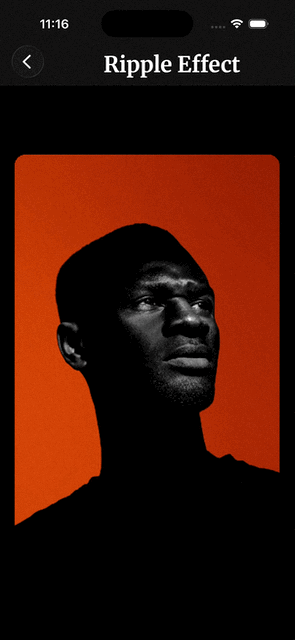

# Ripple Effect

A touch-reactive water ripple shader using Skia RuntimeShader. Tap anywhere to create bouncy ripples that expand outward and reflect from edges.



---

## Required Libraries

```bash
bun add @shopify/react-native-skia react-native-reanimated react-native-gesture-handler react-native-pulsar
```

`react-native-pulsar` drives the haptic on tap (`Presets.ripple()`); the
component also calls `Settings.enableSound(false)` at module load, so the
preset fires without its sound.

---

## How It Works

1. **Tap detected** -> Capture normalized position and timestamp
2. **Outward wave** -> Sinusoidal wave expands from tap point
3. **Reflected wave** -> Second wave bounces back from edges
4. **Refraction applied** -> UV coordinates distorted based on wave amplitude
5. **Decay** -> Both waves fade exponentially for natural damping

Both shaders share that pipeline. The tap writes `u_center` and `u_tapTime`;
everything after is a pure function of `u_time`, so nothing re-renders per
frame.

---

## Two modes

A `LabeledSwitch` at the top of the component picks the shader. It is
internal state, not a prop — there is no way to preselect a mode from
outside.

| Mode | Shader | Source |
|------|--------|--------|
| Basic | `BouncyRippleShader` | `./shaders.ts` |
| Advanced | `BouncyRipplePrismShader` | `../premium/shaders.ts` |

**Advanced** adds prismatic dispersion on top of the same wave: it sharpens
the crest (`pow(crest, 1.8)`), derives a crest-energy term that falls off
with radius, then samples the image three times — R, G and B each at a
slightly different refraction offset — and adds a thin specular highlight on
the crest. Basic samples once and only refracts.

The switch is rendered with `earlyBadge="right"`, so Advanced carries the
early-access badge.

---

## Usage

```tsx
import { RippleEffect } from "@/components/ripple-effect/RippleEffect";

// Basic usage
<RippleEffect />

// Custom image
<RippleEffect imageSource={require("./my-image.png")} />

// Custom sizing
<RippleEffect
  widthRatio={0.95}
  heightRatio={0.5}
  borderRadius={20}
/>
```

---

## Props

| Prop | Type | Default | Description |
|------|------|---------|-------------|
| `imageSource` | `DataSourceParam` | Built-in image | Image to apply ripple effect on |
| `borderRadius` | `number` | `15` | Corner radius for the container |
| `heightRatio` | `number` | `0.65` | Height as percentage of screen (0-1) |
| `widthRatio` | `number` | `0.9` | Width as percentage of screen (0-1) |

---

## Shader Parameters

The `BouncyRippleShader` uses these internal parameters:

| Parameter | Value | Description |
|-----------|-------|-------------|
| `speed` | `0.65` | Wave propagation speed |
| `frequency` | `18.0` | Oscillation frequency |
| `decay` | `3.5` | Exponential damping factor |
| `amplitude` | `0.05` | Refraction strength |

---

## File Structure

```
src/components/ripple-effect/
├── RippleEffect.tsx   # Main component
├── shaders.ts         # Skia shader definitions
└── README.md          # This file
```

