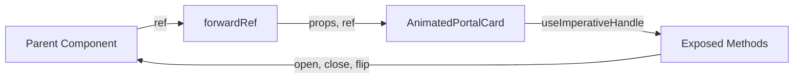

# AnimatedPortalCard

A React Native card component that expands into a fullscreen portal with a 3D flip animation.

---

## Required Libraries

```bash
npm install react-native-reanimated @gorhom/portal
# or
npx expo install react-native-reanimated @gorhom/portal
```

**Setup `@gorhom/portal`** in your root layout:

```tsx
import { PortalProvider } from "@gorhom/portal";

export default function RootLayout() {
  return (
    <PortalProvider>
      {/* Your app */}
    </PortalProvider>
  );
}
```

---

## How It Works

### Animation Flow

1. **User presses trigger** → `measureInWindow()` captures card position
2. **Portal mounts** → Card appears at trigger position
3. **Expand animation** → Card animates to screen center
4. **Flip animation** → Front rotates away, back rotates in (180° Y-axis)
5. **User taps backdrop** → Reverse animations
6. **Portal unmounts** → Trigger fades back in

### Key Concepts

| Concept | Description |
|---------|-------------|
| `animationProgress` | 0 = collapsed, 1 = expanded |
| `flipProgress` | 0 = front visible, 1 = back visible |
| `Portal` | Renders content above all other views |
| `measureInWindow` | Gets trigger's screen coordinates |

---

## Usage

### Basic Example

```tsx
<AnimatedPortalCard
  triggerContent={<MyCard />}
  frontContent={<MyCard />}
  backContent={<SwapScreen />}
/>
```

### With Render Prop (Recommended)

```tsx
<AnimatedPortalCard
  triggerContent={({ onPress }) => (
    <MyCard onButtonPress={onPress} />
  )}
  frontContent={<MyCard />}
  backContent={<SwapScreen />}
/>
```

### With Ref Control

```tsx
const cardRef = useRef<AnimatedPortalCardHandle>(null);

<AnimatedPortalCard
  ref={cardRef}
  triggerContent={<MyCard />}
  frontContent={<MyCard />}
  backContent={<SwapScreen />}
/>

// Control programmatically
cardRef.current?.open();
cardRef.current?.close();
cardRef.current?.flip();
```

---

## Props

| Prop | Type | Default | Description |
|------|------|---------|-------------|
| `triggerContent` | `ReactNode \| (props) => ReactNode` | required | Card shown in list |
| `frontContent` | `ReactNode` | required | Front face when expanded |
| `backContent` | `ReactNode` | required | Back face after flip |
| `expandedWidthRatio` | `number` | `0.7` | Expanded width (% of screen) |
| `expandedHeightRatio` | `number` | `0.7` | Expanded height (% of screen) |
| `flipOnOpen` | `boolean` | `true` | Auto-flip when opening |
| `closeOnBackdropPress` | `boolean` | `true` | Close on backdrop tap |

---

## forwardRef Pattern Explained

### Why forwardRef?

`forwardRef` allows parent components to access internal methods (`open`, `close`, `flip`) via a ref.

### How It Works



```
┌─────────────────────────────────────────────────────┐
│  Parent Component                                   │
│  const cardRef = useRef<AnimatedPortalCardHandle>() │
│                          │                          │
│                          ▼                          │
│  ┌───────────────────────────────────────────────┐  │
│  │  AnimatedPortalCard                           │  │
│  │  forwardRef((props, ref) => {                 │  │
│  │                                               │  │
│  │    useImperativeHandle(ref, () => ({         │  │
│  │      open,   ◄─── exposed to parent          │  │
│  │      close,  ◄─── exposed to parent          │  │
│  │      flip,   ◄─── exposed to parent          │  │
│  │    }));                                       │  │
│  │                                               │  │
│  │  })                                           │  │
│  └───────────────────────────────────────────────┘  │
└─────────────────────────────────────────────────────┘
```

### Implementation

```tsx
// 1. Define handle type
type AnimatedPortalCardHandle = {
  open: () => void;
  close: () => void;
  flip: () => void;
};

// 2. Use forwardRef with types
const AnimatedPortalCard = forwardRef<
  AnimatedPortalCardHandle,  // Ref type
  AnimatedPortalCardProps    // Props type
>((props, ref) => {
  
  // 3. Define internal methods
  const open = () => { /* ... */ };
  const close = () => { /* ... */ };
  
  // 4. Expose methods via useImperativeHandle
  useImperativeHandle(ref, () => ({
    open,
    close,
    flip,
  }));
  
  return (/* JSX */);
});
```

### Key Points

1. **`forwardRef`** - Passes ref from parent to child
2. **`useImperativeHandle`** - Customizes what ref exposes (instead of DOM node)
3. **Type safety** - `AnimatedPortalCardHandle` ensures correct method signatures

---

## File Structure

```
src/components/scale-flip-card/
├── AnimatedPortalCard.tsx  # Main component
├── Card.tsx                # Card & SwapScreen components
├── index.ts                # Exports
└── README.md               # This file
```
