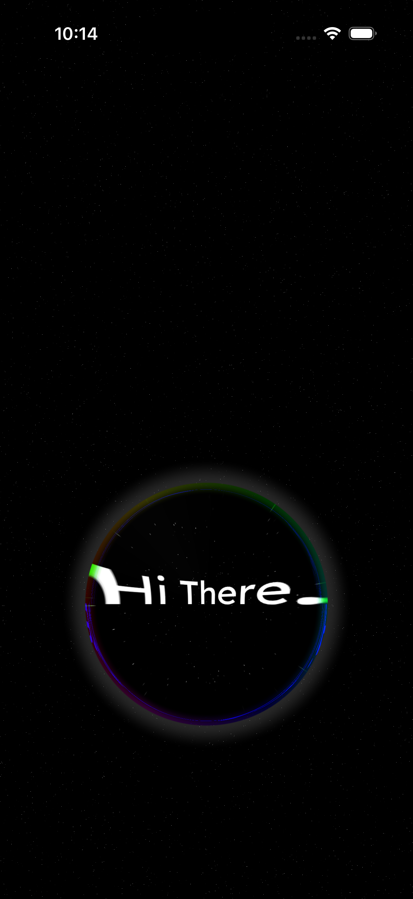
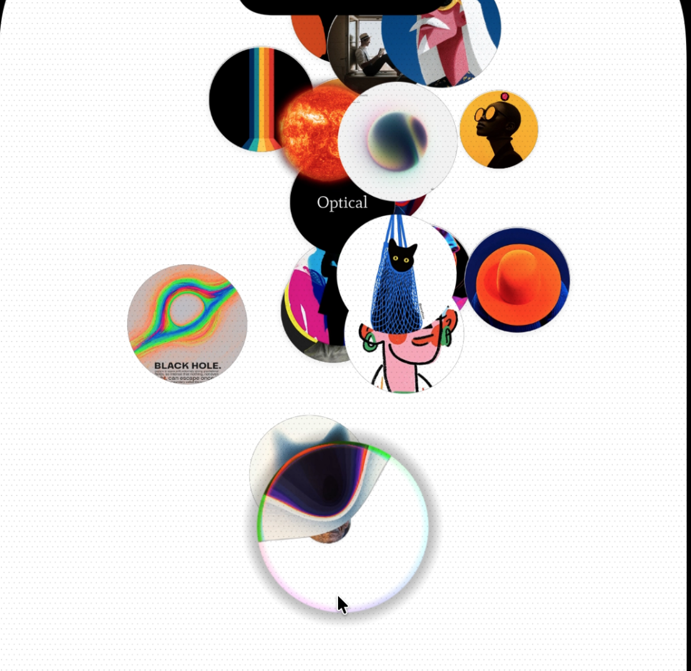

# Wabi Timer Experiment

A fullscreen interactive React Native experience featuring a draggable prism bubble, animated text reveals, split-flap word cycling, and accelerometer-driven particle effects using Skia and Reanimated.


---

## Required Libraries

```bash
bun add @shopify/react-native-skia react-native-reanimated react-native-gesture-handler expo-sensors react-native-pulsar
```

---

## How It Works

### Animation Flow

1. **Initial state** → Prism bubble sits at bottom, "Swipe Up To Start" text visible
2. **User swipes up** → Bubble follows gesture with spring physics, text fades/blurs
3. **Snap to center** → Bubble shrinks, main text fades in, bubbles start rising
4. **Name crossfade** → English/Arabic names alternate with timed fades
5. **Split-flap animation** → Words cycle with flip animation ("Learn", "Build", "Share")
6. **User swipes down** → Reverse animations, bubble returns to bottom

### Key Concepts

| Concept            | Description                                                        |
| ------------------ | ------------------------------------------------------------------ |
| `BShader`          | Skia runtime shader creating a refractive prism/bubble effect      |
| `BubbleGenerator`  | Particle system spawning 46 bubbles in a cone pattern              |
| `NameCrossfade`    | Alternates between English and Arabic text with opacity animations |
| `SplitFlapWord`    | Airport-style flip display cycling through words                   |
| `useBubbleGesture` | Pan gesture hook with spring snap behavior                         |



---

## Usage

```tsx
import WabiTimerExperiment from "@/components/wabi-and-more/WabiTimerExperiment";

export default function Timer() {
  return <WabiTimerExperiment />;
}
```

The component is self-contained and fills the screen. No props required.

---

## Component Variants

| Component             | Purpose                                      |
| --------------------- | -------------------------------------------- |
| `WabiTimerExperiment` | Main orchestrator component                  |
| `BubbleGenerator`     | Accelerometer-driven rising bubble particles |
| `NameCrossfade`       | English ↔ Arabic text crossfade              |
| `SplitFlapWord`       | Cycling word with flip animation             |
| `FlipChar`            | Individual character flip animation          |
| `SwipeIndicator`      | SVG swipe-up hint with fade                  |
| `SocialFooter`        | Animated social media footer                 |

---

## Architecture

### Gesture & Spring System

<!--  -->

```
User Pan Gesture
       │
       ▼
┌─────────────────────────────┐
│  useBubbleGesture hook      │
│  ├─ onBegin: store startY   │
│  ├─ onUpdate: spring follow │
│  └─ onEnd: snap to center   │
│           or bottom         │
└─────────────────────────────┘
       │
       ▼
┌─────────────────────────────┐
│  Shared Values              │
│  ├─ bubbleYPos / bubbleXPos │
│  ├─ bubbleRadius (derived)  │
│  └─ bubbleAtCenter (bool)   │
└─────────────────────────────┘
```

### Bubble Particle System



Bubbles spawn and scale from a narrow point from the center at the bottom and spread outward in different directions as they rise. They also respond to device tilt via accelerometer:

```
           ○       ○   ○       ○
             ○   ○       ○   ○
               ○   ○   ○   ○      ← bubbles spread as they rise
                 ○   ○   ○
                   ○   ○
                     ○
                     │
               Cone Origin (tilts with accelerometer)
```

### Text Animation Layers


```
┌─────────────────────────────────────┐
│  Layer 1: Initial Text              │  ← "Swipe Up To Start" (fades out)
│  Layer 2: Main Greeting             │  ← "Hi There." (fades in)
│  Layer 3: Name Crossfade            │  ← English ↔ Arabic
│  Layer 4: Split-Flap Word           │  ← "I like to [Learn] stuff."
└─────────────────────────────────────┘
```

---

## Configuration

Constants are defined in `constants.ts`:

| Constant              | Value                            | Description                         |
| --------------------- | -------------------------------- | ----------------------------------- |
| `BUBBLE_RADIUS`       | `200`                            | Initial bubble size at bottom       |
| `FONT_SIZE`           | `28`                             | Text size for all labels            |
| `TEXT_GAP`            | `15`                             | Vertical spacing between text lines |
| `SPRING_SNAP_PROPS`   | `{stiffness: 550, damping: 140}` | Snap-to-position spring             |
| `SPRING_FOLLOW_PROPS` | `{stiffness: 300, damping: 30}`  | Follow-gesture spring               |

---

## File Structure

```
src/components/wabi-and-more/
├── WabiTimerExperiment.tsx   # Main component
├── BShader.ts                # Prism bubble shader
├── BGTailwindShader.ts       # Background dot grid shader
├── BubbleGenerator.tsx       # Particle system
├── NameCrossfade.tsx         # English/Arabic text crossfade
├── SplitFlapWord.tsx         # Flip word animation
├── FlipChar.tsx              # Single character flip
├── SwipeIndicator.tsx        # Swipe hint SVG
├── SocialFooter.tsx          # Social media footer
├── constants.ts              # Shared constants
├── hooks/
│   ├── useBubbleGesture.ts   # Pan gesture logic
│   └── useParagraphBuilder.ts # Skia paragraph builder
└── README.md
```
